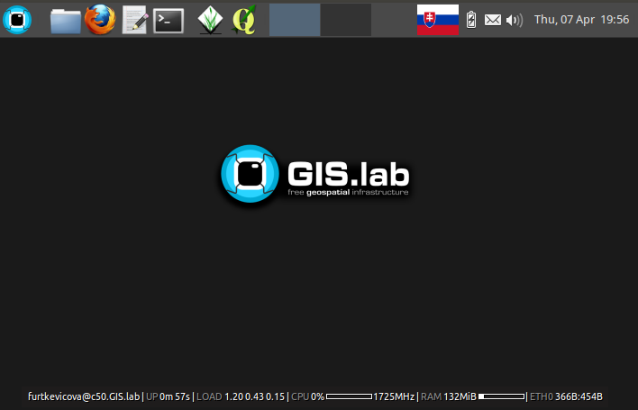

.. _layout:
 
*********************
Client Desktop layout
*********************

.. todo:: |todo| Dokončiť, opýtať sa!

* IRC server

  To allow effective communication between all GIS.lab users without a need 
  of internet connection, GIS.lab provides built-in IRC server and 
  prepared ``#gislab`` chat room.

* QGIS development support in GIS.lab

  To to automatize building and installation of QGIS software from Git source 
  code, following scripts should be run on client machine.
  First of them downloads latest QGIS source code and makes install
  and second script runs QGIS installed from source code.

  1. ``gislab-dev-qgis-install`` 
  2. ``gislab-dev-qgis``   

* QGIS GIS.lab edition

.. _gislab-qgis:

.. figure:: ../img/installation/gislab-qgis.png
   :align: center
   :width: 450

   QGIS GIS.lab edition.
