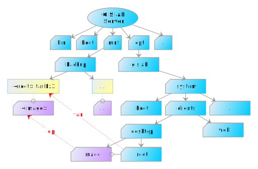

.. _gislab-customization:
 
*************
Customization
*************

When talking about customization, we should distinguish between

1. :ref:`Server customization <server-customization>`
2. :ref:`User accounts customization <user-customization>`
3. :ref:`Client customization <client-customization>`

.. _server-customization:

1. GIS.lab Server can be customized by running standard Linux/Ubuntu
commands, but it is recommended to use some isolated environment like
`LXC <https://linuxcontainers.org/lxc/introduction/>`_ or 
`Docker <https://www.docker.com/>`_ containers when deploying custom service.

.. seealso:: |see| `Understanding the key differences between LXC and Docker <https://www.flockport.com/lxc-vs-docker/>`_

.. _user-customization:

Process of creation and removal of GIS.lab user accounts can be
customized by special scripts. 

.. important:: |imp| Scripts must have executable permissions assigned and 
   can't contain file extension, see ``man run-parts``. 

Directory ``/opt/gislab/custom/accounts`` in :num:`#customization-files` 
contains following directories with customization scripts.

* ``before add`` - executed before account is created
* ``after add`` - executed before account is deleted
* ``before delete`` - executed before account is deleted
* ``after delete`` - executed after account is deleted
* ``files`` - content of this directory is copied to user's home directory 
  before ``after-add`` hooks are executed

.. _customization-files:

.. figure:: ../img/customization/customization-files.svg
   :align: center
   :width: 450

   Example of directory structure of customization files.

In above customization scripts it is possible to use various variables. 
When creating or deleting GIS.lab user account using ``gislab-adduser`` and 
``gislab-deluser`` commands, following variables can be used.
 
  * ``GISLAB_USER`` - user name 
  * ``GISLAB_USER_GIVEN_NAME`` - first name 
  * ``GISLAB_USER_SURNAME`` - last name 
  * ``GISLAB_USER_EMAIL`` - email 
  * ``GISLAB_USER_DESCRIPTION`` - description
  * ``GISLAB_USER_SUPERUSER`` - superuser status 
  * ``GISLAB_USER_GROUPS`` - groups membership

For content stored in ``files`` directory, it is possible to use template
variables in following format. 

* gislab-adduser 

  * ``{+ GISLAB_USER +}`` - user name 
  * ``{+ GISLAB_USER_GIVEN_NAME +}`` - first name 
  * ``{+ GISLAB_USER_SURNAME +}`` - last name 
  * ``{+ GISLAB_USER_EMAIL +}`` - email 
  * ``{+ GISLAB_USER_DESCRIPTION +}`` - description 
  * ``{+ GISLAB_USER_SUPERUSER +}`` - superuser status 
  * ``{+ GISLAB_USER_GROUPS+}`` - groups membership

Example customization script ``db`` in ``after-add`` directory for automatic 
database schema creation called **schemaname** after new GIS.lab user is added 
is shown below.

.. code:: sh

   #!/bin/sh
   
   create_schema() {
       if [ ! -z `sudo -u postgres psql -lqt | cut -d \| -f 1 | grep -w $1` ]; then
           echo "CREATE SCHEMA $GISLAB_USER;
   GRANT USAGE on SCHEMA $GISLAB_USER to $GISLAB_USER;
   GRANT SELECT ON ALL TABLES IN SCHEMA $GISLAB_USER TO $GISLAB_USER;
   GRANT all ON SCHEMA $GISLAB_USER to $GISLAB_USER" | \
               sudo -u postgres psql $1
       fi
   }
   
   create_schema schemaname
       
   exit 0

.. _client-customization:

.. note:: |note| In the following lines basics of GIS.lab client's customization 
   will be described. GIS.lab client means **GIS.lab Desktop client**. There can 
   also be **GIS.lab Web client**, etc.

GIS.lab client can be customized by running standard Linux/Ubuntu commands as
well as :ref:`GIS.lab server <sever-customization>`. Difference is that they 
must be executed in isolated environment called **chroot**. Administrator 
scripts :ref:`gislab-client-shell <gislab-client-shell>` 
and :ref:`gislab-client-image <gislab-client-image>` are used to perform this 
action. 

Important file is **image file**. It is a binary file with the ``.img`` filename 
extension and represents a snapshot of the data and layout of some GIS.lab
client. More specifically, it is compressed client's chroot. All GIS.lab clients
boot from some image file. 
Usually after entering client's ``chroot`` with the first of above mentioned commands, 
the new updated ``image`` is rebuilded by the second of these commands. 

.. important:: |imp| Client's ``chroot`` and resulting ``image`` are always restored 
   to original state after every GIS.lab upgrade, so customization must be
   applied again.

.. note:: |note| This behaviour is planed to be changed in future.

Important note written above is precisely why **backup** should always be used. 
In general, it is very good idea to backup client's ``chroot`` and also ``image`` 
in case if something will go wrong in process of customization or rollback is
required. Backup operation can be done by simple backup of them. 
Approximate total backup size is ``2 GB``.

Backup of client's ``chroot`` directory can be created by following statement
using tape archive command.
Command for client's ``image`` backup is introduced below. 

.. code:: sh

   $ sudo tar cjf /mnt/backup/<root>.tar.bz2 /opt/gislab/system/clients/desktop/root

   $ sudo cp -a /opt/gislab/system/clients/desktop/image /mnt/backup/<image>

See also :num:`#backup` for clearer understanding.

.. _backup:

   Recommended backup of client's files.

.. note:: |note| Backup of clients ``image`` file is not necessary because 
   it can always be created by ``gislab-client-image`` command from particular 
   GIS.lab ``chroot``. Why also this backup is useful will be introduced later.

When the recommended backups are created, it is time to start with customization.
If backup directory contains some backup of client's root and image it is 
possible to use them, i.e. :ref:`recover backup <recover-backup>`.

.. _recover-backup:

First of all current client's ``root`` and ``image`` should be removed. Afterwards 
selected backup of them can be recovered.

.. code::

   $ sudo rm -r /opt/gislab/system/clients/desktop/root
   $ sudo rm -r /opt/gislab/system/clients/desktop/image

   $ sudo tar xjf /mnt/backup/<root>.tar.bz2 -C /
   $ sudo cp -a /mnt/backup/<image>/ /opt/gislab/system/clients/desktop/image

.. rubric:: Example

Let's see example custom installation of **latest GDAL version** from source code.

At first client's chroot should be entered.

.. code:: sh

   $ sudo gislab-client-shell -i

Then compilation and installation of GDAL should be executed.

.. code:: sh

   $ apt-get -y install g++ subversion
   $ cd /tmp
   $ svn checkout https://svn.osgeo.org/gdal/trunk/gdal gdal
   $ cd gdal
   $ ./configure
   $ make
   $ make install

After client's ``root`` is left by ``exit`` command, then ``image`` should 
be updated by ``sudo gislab-client-image``.

.. important:: |imp| Do not forget to set ``LD_LIBRARY_PATH`` variable on 
   client before running GDAL commands.
   
   .. code:: sh

      $ export LD_LIBRARY_PATH=/usr/local/lib:$LD_LIBRARY_PATH
      $ /usr/local/bin/ogr2ogr --version
      GDAL 2.0.0dev, released 2014/04/16

Relating to mode, we should distinguish between :ref:`Physical <customization-physical>`
and :ref:`Virtual <customization-virtual>` Mode.

.. toctree::
   :maxdepth: 2

   physical
   virtual
