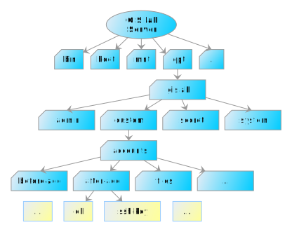

.. _gislab-customization:
 
*************
Customization
*************

When talking about customization, we should distinguish between

1. :ref:`Server customization <server-customization>`
2. :ref:`User accounts customization <user-customization>`
3. :ref:`Desktop client customization <client-customization>`

.. _server-customization:

GIS.lab Server can be customized by running standard Linux/Ubuntu
commands, but it is recommended to use some isolated environment like
`LXC <https://linuxcontainers.org/lxc/introduction/>`_ or 
`Docker <https://www.docker.com/>`_ containers when deploying custom service.

.. seealso:: |see| `Understanding the key differences between LXC and Docker <https://www.flockport.com/lxc-vs-docker/>`_

.. _user-customization:

Process of creation and removal of GIS.lab user accounts can be
customized by special scripts. 

.. important:: |imp| Scripts must have executable permissions assigned and 
   can't contain file extension, see ``man run-parts``. 

Directory ``/opt/gislab/custom/accounts`` in :num:`#customization-files` 
contains following directories with customization scripts.

* ``before add`` - executed before account is created
* ``after add`` - executed before account is deleted
* ``before delete`` - executed before account is deleted
* ``after delete`` - executed after account is deleted
* ``files`` - content of this directory is copied to user's home directory 
  before ``after-add`` hooks are executed

.. _customization-files:

   Example of directory structure of customization files.

In above customization scripts it is possible to use various variables. 
When creating or deleting GIS.lab user account using ``gislab-adduser`` and 
``gislab-deluser`` commands, following variables can be used.
 
  * ``GISLAB_USER`` - user name 
  * ``GISLAB_USER_GIVEN_NAME`` - first name 
  * ``GISLAB_USER_SURNAME`` - last name 
  * ``GISLAB_USER_EMAIL`` - email 
  * ``GISLAB_USER_DESCRIPTION`` - description
  * ``GISLAB_USER_SUPERUSER`` - superuser status 
  * ``GISLAB_USER_GROUPS`` - groups membership

For content stored in ``files`` directory, it is possible to use template
variables in following format. 

* gislab-adduser 

  * ``{+ GISLAB_USER +}`` - user name 
  * ``{+ GISLAB_USER_GIVEN_NAME +}`` - first name 
  * ``{+ GISLAB_USER_SURNAME +}`` - last name 
  * ``{+ GISLAB_USER_EMAIL +}`` - email 
  * ``{+ GISLAB_USER_DESCRIPTION +}`` - description 
  * ``{+ GISLAB_USER_SUPERUSER +}`` - superuser status 
  * ``{+ GISLAB_USER_GROUPS+}`` - groups membership

Example customization script ``db`` in ``after-add`` directory for automatic 
database schema creation called `someschema` after new GIS.lab user is added is shown below.

.. code:: sh

   #!/bin/sh
   
   create_schema() {
       if [ ! -z `sudo -u postgres psql -lqt | cut -d \| -f 1 | grep -w $1` ]; then
           echo "CREATE SCHEMA $GISLAB_USER;
   GRANT USAGE on SCHEMA $GISLAB_USER to $GISLAB_USER;
   GRANT SELECT ON ALL TABLES IN SCHEMA $GISLAB_USER TO $GISLAB_USER;
   GRANT all ON SCHEMA $GISLAB_USER to $GISLAB_USER" | \
               sudo -u postgres psql $1
       fi
   }
   
   create_schema someschema
       
   exit 0

.. _client-customization:

* chroot, backup, recover backup, ... DOKONCIT ZAJTRA

Relating to mode, we should distinguish between :ref:`Physical <customization-physical>`
and :ref:`Virtual <customization-virtual>` Mode.

.. toctree::
   :maxdepth: 2

   physical
   virtual
