.. _data:

*********
Data sets
*********

Some basic information about our data aiming to be a part of examples indroduced
in this documentation.

================
1. Natural earth
================

Database ``natural-earth.sqlite``:

.. rubric:: Data source

The data is sourced from `Natural Earth dataset <http://www.naturalearthdata.com/downloads/>`_. It is a public domain map dataset available at ``1:10 million``, 
``1:50 million``, and ``1:110 million`` map scales. It is 
free for use in any type of project. 
Dataset was built through a collaboration of many volunteers, it is supported 
by *NACIS* - North American Cartographic Information Society and contains a series 
of vector and raster data. With Natural Earth one can make a variety of maps 
with all commonly used cartography and GIS software. 

.. rubric:: Coordinate systems

All Natural Earth data use the Geographic coordinate system WGS84, 
datum ``+proj=longlat +ellps=WGS84 +datum=WGS84 +no_defs``.

.. rubric:: Format and other key features

Natural Earth Vector comes in ESRI shapefile format. Character encoding is 
``Windows-1252``. Vector features include name attributes and bounding box extent.
Natural Earth Raster comes in TIFF format with a TFW world file. 

Natural Earth is very useful collection of data. Most of their attributes are 
equally important for mapmaking. They contain embedded feature names, 
which are ranked by relative importance. Other attributes 
facilitate faster map production, such as width attributes assigned to river 
segments for creating tapers, etc.

---------------
Thematic layers
---------------

**Area** - matched boundary polygon for area of interest (administrative areas)

* *Layer name* : ``area``
* *Storage type* : SQLite database
* *Geometry type of the features in layer* : Polygon

**Countries** - matched boundary lines and polygons with various attributes for 
countries

* *Layer name* : ``countries``
* *Storage type* : SQLite database
* *Geometry type of the features in layer* : Polygon
* *Attributes* :

.. csv-table:: Attributes of country layer.
   :header: "Name", "Description"
   :widths: 10, 10

   "*adm0_a3*", "country code"
   "*name*", "estimated total population"
   "*gdp_md_est*", "estimated total GDP in millions of dollars"
   "*subregion*", "part of a larger region or continent"

**Places** - point symbols with name attributes. Includes DEM data, population 
data and other information (urban landscape)

* *Layer name* : ``places``
* *Storage type* : SQLite database
* *Geometry type of the features in layer* : Point
* *Attributes* :

.. csv-table:: Attributes of places layer.
   :header: "Name", "Description"
   :widths: 10, 10

   "*name*", "name of entity"
   "*adm0name*", "country name"
   "*adm0_a3*", "country code"
   "*adm1name*", "sub-country name"
   "*lattitude*", "latitude of interior point (degrees)"
   "*longitude*", "longitude of interior point (degrees)"
   "*pop_max*", "population for the metropolitan area	"
   "*pop_min*", "population for the incorporated city"
   "*gtopo30*", "DEM with 30-arc second resolution"
   "*timezone*", "timezone"

**Roads** - road lines with attributes 

* *Layer name* : ``roads``
* *Storage type* : SQLite database
* *Geometry type of the features in layer* : Line
* *Attributes* :

.. csv-table:: Attributes of places layer.
   :header: "Name", "Description"
   :widths: 10, 10

   "*type*", "type of road"
   "*length_km*", "road length (km)"
   "*label*", "label"
   "*local*", "local label"
   "*expressway*", "1 for expressway, 0 for other"

=========
2. Prague
=========

Database ``prague.sqlite``:

.. rubric:: Data source

The data is sourced from 
open data `IPR <http://www.geoportalpraha.cz/en/opendata>`_ provided by 
*Prague Institute of Planning and Development*, open data 
`RÚIAN <http://vdp.cuzk.cz/vdp/ruian/stat/>`_ supplied by the 
*Registry of Territorial Identification, Addresses and Real Estate*, data 
`DIBAVOD <http://www.dibavod.cz/index.php?id=27&PHPSESSID=vcbxqccbl>`_ provided 
by *T. G. Masaryk water research institute, public research institution* and 
from great resource for free and openly licensed data, 
`OpenStreetMap (OSM) <http://www.openstreetmap.org/>`_. Some statistics data
are from `Czech statistical office <https://www.czso.cz/csu/czso/home>`_.

.. rubric:: Coordinate systems (Reference system)

All data in Prague dataset use referense system ``102067``, S-JTSK/Krovak 
(East/North). 

.. rubric:: Format and other key features

Vector data comes in ESRI shapefile format. Character encoding is ``Windows-1252``.
Raster comes in TIFF format.

* *Extent around:* ``50.3 (N), 49.9 (S), 14.8 (E), 14.2 (W)``

---------------
Thematic layers
---------------

**administrative districts** - administrative boudaries in Prague 

* *Layer name:* ``districts``
* *Storage type:* SQLite database
* *Geometry type of the features in layer* : Multipolygon
* *Attributes* :

.. csv-table:: Attributes of administrative districts layer.
   :header: "Name", "Description"
   :widths: 10, 10

   "*code*", "code of district"
   "*name*", "name of district"

**air pollution** - bonita of climate in terms of air pollution (I - the best, V - the worse)

* *Layer name:* ``air_pollution``
* *Storage type:* SQLite database
* *Last update:* 01.01.2008
* *Geometry type of the features in layer* : Polygon
* `Source <http://www.geoportalpraha.cz/cs/opendata/5BB4E2C5-9D4B-4B2B-BF0A-E0B98EE6013A>`_
* *Attributes* :

.. csv-table:: Attributes of air pollution layer.
   :header: "Name", "Description"
   :widths: 10, 10

   "*value*", "bonita of climate in terms of air pollution"

**basins** - hydrological structure, basins of IV. code

* *Layer name:* ``basins``
* *Storage type:* SQLite database
* *Last update:* 06.04.2006
* *Geometry type of the features in layer* : Polygon
* `Source <http://www.dibavod.cz/download.php?id_souboru=1418&PHPSESSID=vcbxqccbl>`_
* *Attributes* :

.. csv-table:: Attributes of basins layer.
   :header: "Name", "Description"
   :widths: 10, 10

   "*number*", "number of basin"
   "*area*", "area in square kilometre"
   
**bike routes** - cycling routes marked, registered and others

* *Layer name:* ``bike_routes``
* *Storage type:* SQLite database
* *Last update:* 14.03.2016
* *Geometry type of the features in layer* : Multilinestring
* *Spatial resolution:* `1:10000`
* `Source <http://www.geoportalpraha.cz/en/opendata/0AF6DE97-68B3-4CD6-AE5D-76ACEEE50636>`_,
  `metadata <http://www.geoportalpraha.cz/cs/fulltext_geoportal?id=0AF6DE97-68B3-4CD6-AE5D-76ACEEE50636>`_
* *Attributes* :

.. csv-table:: Attributes of bike routes layer.
   :header: "Name", "Description"
   :widths: 10, 10

   "*number*", "number of route"
   "*state*", "traffic state"
   "*one_way*", "D means one-way route"

**bike signs** - bicycle transport signs

* *Layer name:* ``bike_signs``
* *Storage type:* SQLite database
* *Last update:* 14.03.2016
* *Geometry type of the features in layer* : Multipoint
* *Spatial resolution:* `1:10000`
* `Source <http://www.geoportalpraha.cz/cs/opendata/7ED6D2D8-A68C-44F1-8EC3-0F75A5AEF781>`_,
  `metadata <http://www.geoportalpraha.cz/cs/fulltext_geoportal?id=7ED6D2D8-A68C-44F1-8EC3-0F75A5AEF781>`_
* *Attributes* :

.. csv-table:: Attributes of bike signs layer.
   :header: "Name", "Description"
   :widths: 10, 10

   "*type*", "type of sign"

**boundary region** - boundary of Prague region

* *Layer name:* ``boundary_region``
* *Storage type:* SQLite database
* *Last update:* 04.05.2014
* *Geometry type of the features in layer* : Multipolygon
* `Source <http://www.geoportalpraha.cz/cs/opendata/669607B8-EA0A-44FB-8771-C509C2384E59>`_
* *Attributes* :

.. csv-table:: Attributes of boundary region.
   :header: "Name", "Description"
   :widths: 10, 10

   "*name*", "name of region"

**buildings** - classified raster with absolute altitude of buildings

* *Layer name:* ``buildings_3d``
* *Storage type:* SQLite database
* *Spatial representation:* 3D grid 
* `Source <http://www.geoportalpraha.cz/en/opendata/DDBD51D9-CDF6-4288-8FAB-F049BB5ADFD9>`_

**elevation** - digital terrain model (DTM) within the meaning of the bare surface

* *Layer name:* ``elevation``
* *Storage type:* SQLite database
* *Last update:* 10.04.2015
* *Spatial representation:* 3D grid
* *Spatial resolution:* 1:5000
* `Source <http://www.geoportalpraha.cz/en/opendata/6E9A6D83-5F66-4B06-ABB5-CE8E773A811C>`_

**landuse** - landuse in 2016

* *Layer name:* ``landuse``
* *Storage type:* SQLite database
* *Last update:* 24.02.2016
* *Spatial resolution:* 1:5000
* *Geometry type of the features in layer* : Multipolygon
* `Source <http://www.geoportalpraha.cz/en/opendata/A0198E36-FCAD-42E7-BE4A-3B7755A48DAC>`_
* *Attributes* :

.. csv-table:: Attributes of landuse layer.
   :header: "Name", "Description"
   :widths: 10, 10

   "*code*", "code of usage"

**ortophoto** - colored orthophoto of Prague 1 district 

* *Layer name:* ``ortophoto``
* *Pixel resolution:* ``50 cm``
* *Storage type:* SQLite database
* *Last update:* 10.12.2015
* *Spatial representation:* vector
* `Source <http://www.geoportalpraha.cz/cs/opendata/A0198E36-FCAD-42E7-BE4A-3B7755A48DAC>`_,
  `metadata <http://www.geoportalpraha.cz/en/fulltext_geoportal?id=A0198E36-FCAD-42E7-BE4A-3B7755A48DAC>`_

**parcels** - polygons of the parcels for some areas

* *Layer name:* ``parcels``
* *Storage type:* SQLite database
* *Last update:* 01.03.2016
* *Geometry type of the features in layer* : Multipolygon
* *Spatial resolution:* `1:500`
* `Source <http://www.geoportalpraha.cz/en/opendata/31363CF6-2A9F-41D1-B000-23587084BC7A>`_
* *Attributes* :

.. csv-table:: Attributes of parcels layer.
   :header: "Name", "Description"
   :widths: 10, 10

   "*parcel*", "parcel number"
   "*code*", "code of cadastral region"

**pharmacy** - pharmacies

* *Layer name:* ``pharmacy``
* *Geometry type of the features in layer* : Multipoint
* *Attributes* :

.. csv-table:: Attributes of pharmacy layer.
   :header: "Name", "Description"
   :widths: 10, 10

   "*name*", "name of pharmacy"

**population statistics** - marriages, divorces, live births and deaths statistics for Prague districts in 2014

* *Layer name:* ``pop_statistics``
* *Data representation:* comma separated values file
* *Last update*: 31.12.2014
* `Source <https://www.czso.cz/documents/10180/26823476/3301231505.xlsx/1e37f0cd-ef06-4872-b108-31778585b635?version=1.0>`_

.. csv-table:: Some population statistics.
   :header: "Name", "Description"
   :widths: 10, 10

   "*district*", "name of district"
   "*marriages*", "marriages in 2014"
   "*divorces*", "divorces in 2014"
   "*live births*", "live births"
   "*deaths*", "deaths"

**public toilets** - public toilets

* *Layer name:* ``public_toilets``
* *Storage type:* SQLite database
* *Last update:* 20.07.2015
* *Geometry type of the features in layer* : Multipoint
* `Source <http://www.geoportalpraha.cz/en/opendata/27028B3A-9442-44BC-9EA2-4DF8A2DF9940>`_
* *Attributes* :

.. csv-table:: Attributes of public toilets layer.
   :header: "Name", "Description"
   :widths: 10, 10

   "*locality*", "the position or site of public toilet"
   "*address*", "address of public toilet"
   "*open*", "open hours"
   "*price*", "price for usage"
   "*invalid*", "1 for invalid toilet"

**public_wifi** - WiFi facilities allowing to connect to the Internet within a particular area

* *Layer name:* ``public_wifi``
* *Geometry type of the features in layer* : Multipoint
* *Attributes* :

.. csv-table:: Attributes of public WiFi layer.
   :header: "Name", "Description"
   :widths: 10, 10

   "*wifi*", "more details about WiFi"

**railways** - railways

* *Layer name:* ``railways``
* *Geometry type of the features in layer* : Multilinestring
* *Attributes* :

.. csv-table:: Attributes of railways layer.
   :header: "Name", "Description"
   :widths: 10, 10

   "*osm_id*", "OSM id"

**schools** - schools

* *Layer name:* ``schools``
* *Geometry type of the features in layer* : Multipoint
* *Attributes* :

.. csv-table:: Attributes of schools layer.
   :header: "Name", "Description"
   :widths: 10, 10

   "*name*", "name and type of school"

**streams** - water flow (flow model)

* *Layer name:* ``streams``
* *Storage type:* SQLite database
* *Last update:* 06.04.2006
* *Geometry type of the features in layer* : Multilinestring
* `Source <http://www.dibavod.cz/download.php?id_souboru=1412&PHPSESSID=vcbxqccbl>`_
* *Attributes* :

.. csv-table:: Attributes of streams layer.
   :header: "Name", "Description"
   :widths: 10, 10

   "*name*", "name of stream"

**streets** - roads and streets

* *Layer name:* ``streets``
* *Geometry type of the features in layer* : Multilinestring
* *Storage type:* SQLite database
* *Attributes* :

.. csv-table:: Attributes of streets layer.
   :header: "Name", "Description"
   :widths: 10, 10

   "*name*", "name of street"

**universities** - schools

* *Layer name:* ``universities``
* *Spatial representation:* vector
* *Geometry type of the features in layer* : Multipoint
* *Attributes* :

.. csv-table:: Attributes of universities layer.
   :header: "Name", "Description"
   :widths: 10, 10

   "*name*", "name of university"

**zipcodes** - address points of RUIAN

* *Layer name:* ``zipcodes``
* *Storage type:* SQLite database
* *Attributes* :

.. csv-table:: Attributes of zipcode layer.
   :header: "Name", "Description"
   :widths: 10, 10

   "*number*", "number of building"
   "*code*", "zipcode"

==============
Issues (draft)
==============

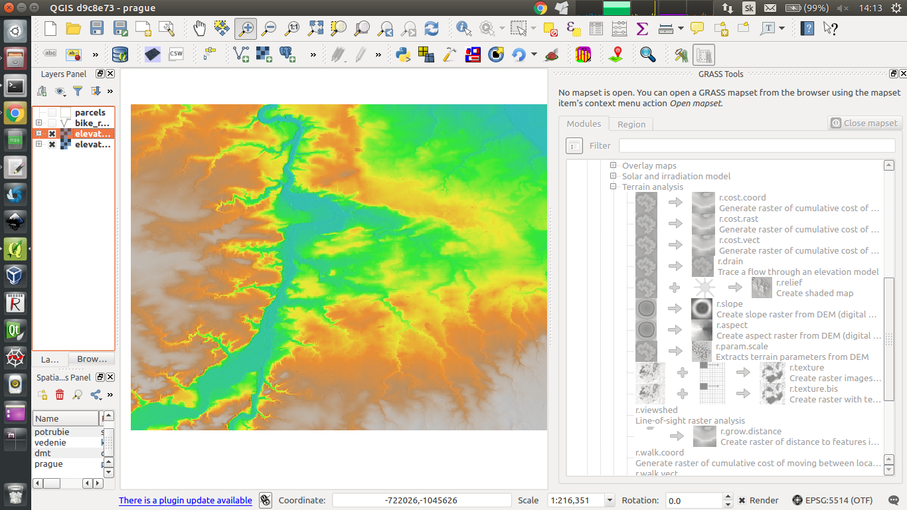

   Elevation map in combination with shaded relief.

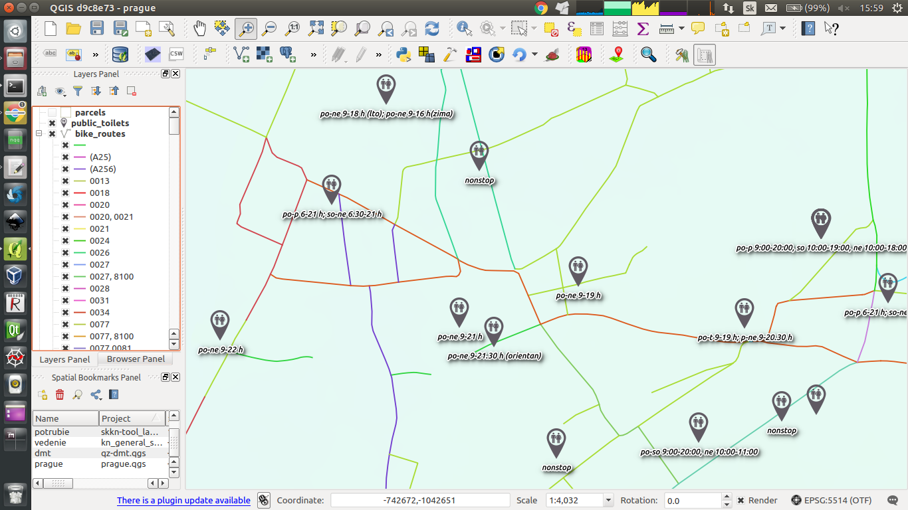
   
   Public toilets with information about opening hours.

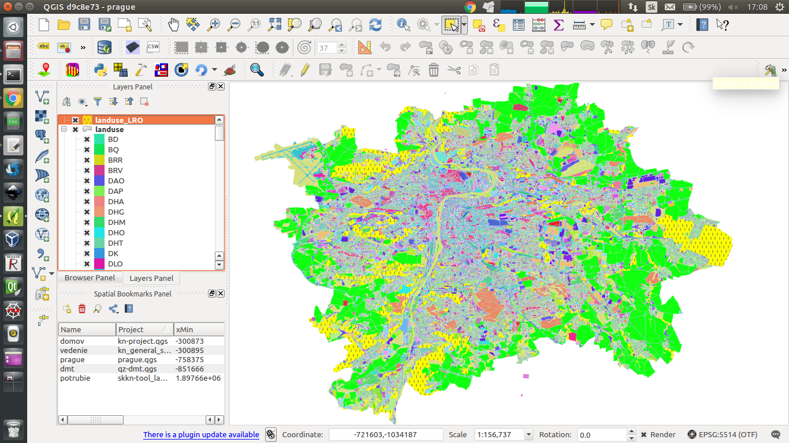

   Selection of forests in landuse layer.
   

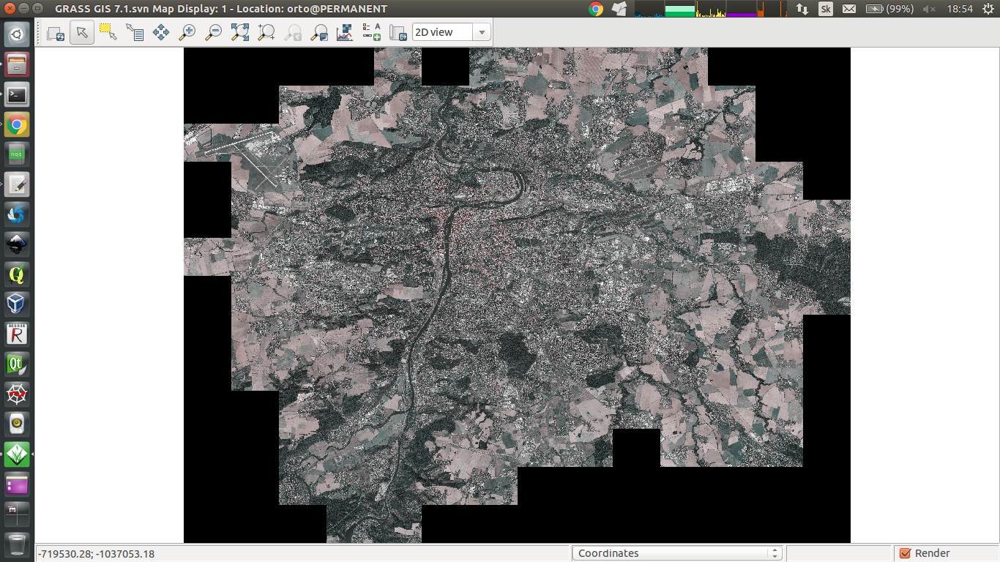

   Ortophoto of Prague in GRASS GIS environment.

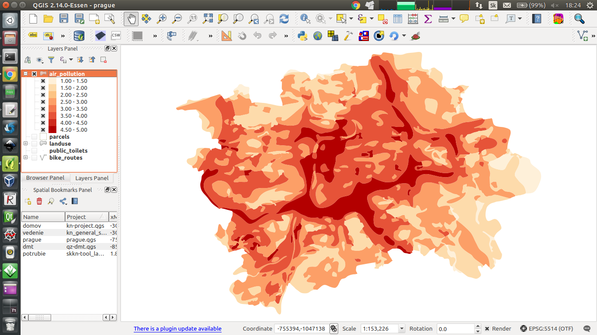

   Bonita of climate in terms of air pollution.

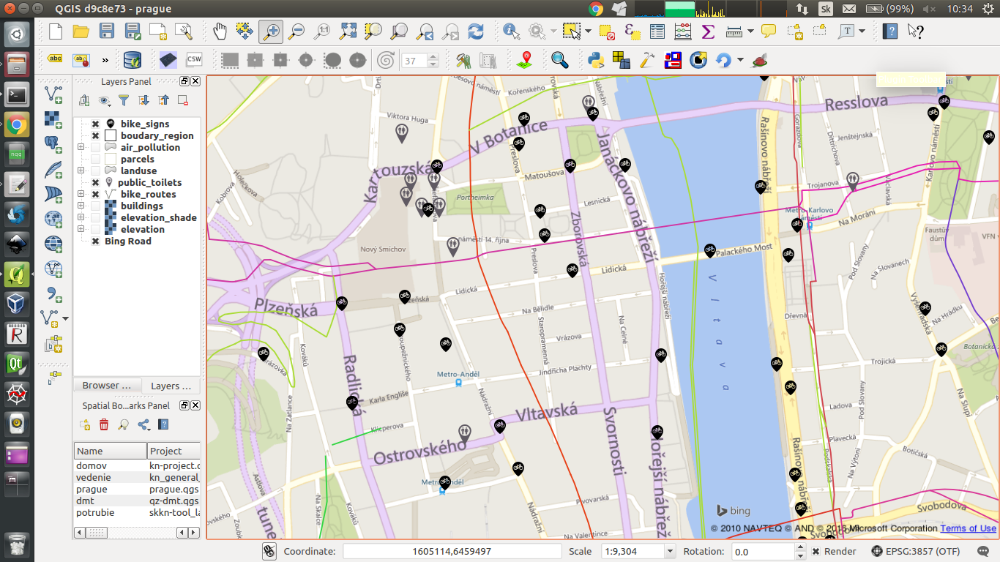

   Bike signs and public toilets overlapping Bing Road map.

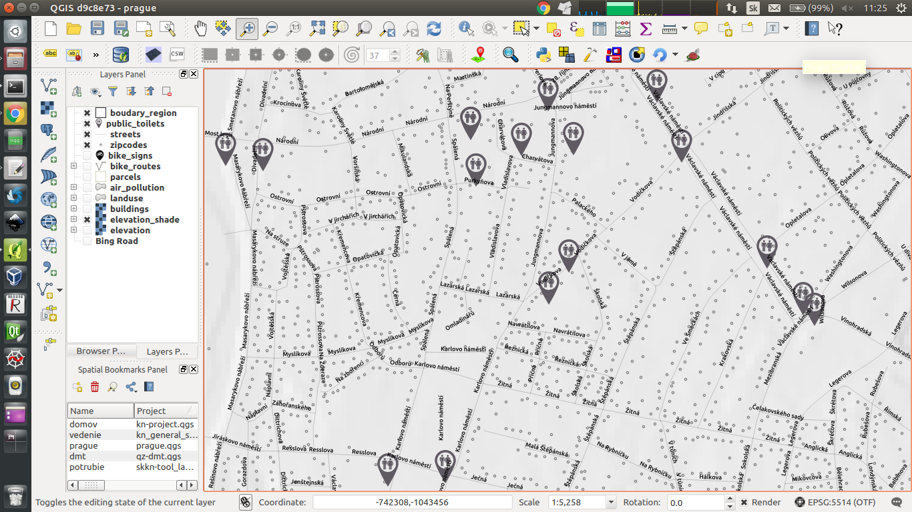

   Zipcodes, streets and public toilets.

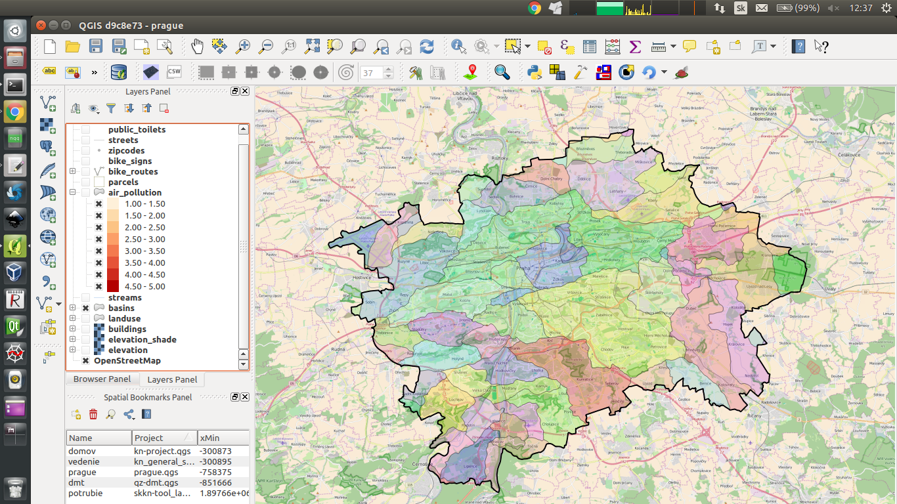

   Basins of IV. code in Prague.

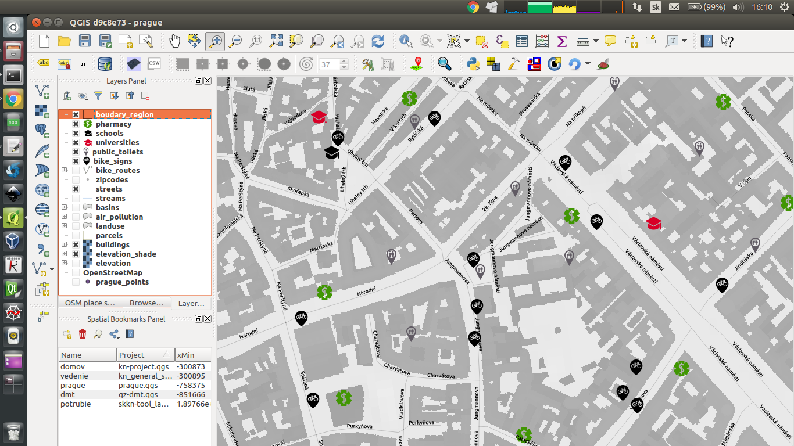

   Some OSM point data in Prague.

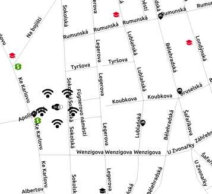

   Public wifi.

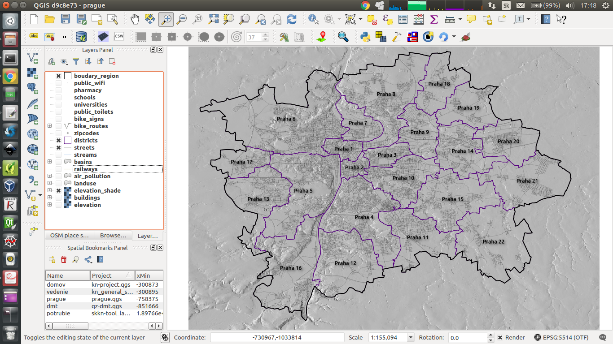

   Boundaries of administrative districts in Prague.
