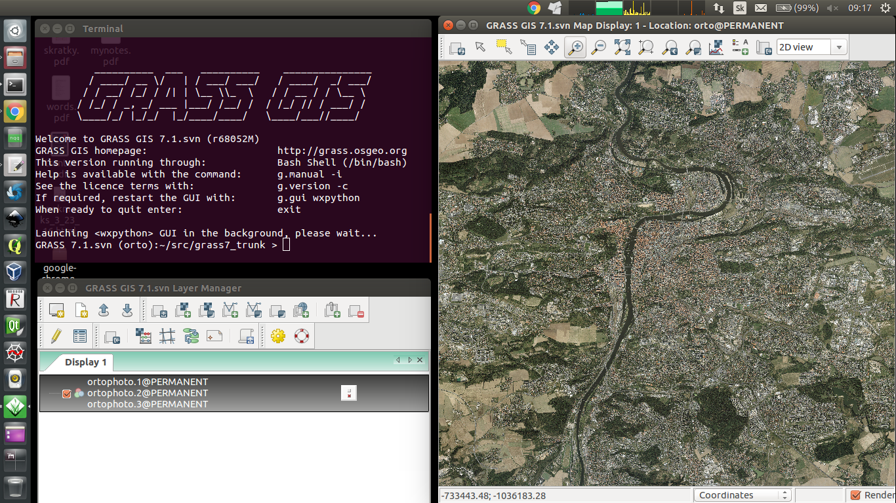

.. _data:

*********
Data sets
*********

Some basic information about our data aiming to be a part of examples indroduced
in this documentation.

================
1. Natural earth
================

Database ``natural-earth.sqlite``:

.. rubric:: Data source

The data is sourced from `Natural Earth dataset <http://www.naturalearthdata.com/downloads/>`_. It is a public domain map dataset available at ``1:10 million``, 
``1:50 million``, and ``1:110 million`` map scales. It is 
free for use in any type of project. 
Dataset was built through a collaboration of many volunteers, it is supported 
by *NACIS* - North American Cartographic Information Society and contains a series 
of vector and raster data. With Natural Earth one can make a variety of maps 
with all commonly used cartography and GIS software. 

.. rubric:: Coordinate systems

All Natural Earth data use the Geographic coordinate system WGS84, 
datum ``+proj=longlat +ellps=WGS84 +datum=WGS84 +no_defs``.

.. rubric:: Format and other key features

Natural Earth Vector comes in ESRI shapefile format. Character encoding is 
``Windows-1252``. Vector features include name attributes and bounding box extent.
Natural Earth Raster comes in TIFF format with a TFW world file. 

Natural Earth is very useful collection of data. Most of their attributes are 
equally important for mapmaking. They contain embedded feature names, 
which are ranked by relative importance. Other attributes 
facilitate faster map production, such as width attributes assigned to river 
segments for creating tapers, etc.

---------------
Thematic layers
---------------

1. Administrative areas

**Area** - matched boundary polygon for area of interest

* *Layer name* : ``area``
* *Storage type* : SQLite database
* *Geometry type of the features in layer* : Polygon
* *Primary key attributes* : PK_UID 
* *The number of features* : 1
* *The number of attributes* : 0
* *In layer spatial reference system units* : ``xMin = 5.75267, yMin = 45.3242, xMax = 24.2430, yMax = 55.1653``

**Countries** - matched boundary lines and polygons with various attributes for 
countries

* *Layer name* : ``countries``
* *Storage type* : SQLite database
* *Geometry type of the features in layer* : Polygon
* *Primary key attributes* : PK_UID 
* *The number of features* : 9
* *The number of attributes* : 5
* *In layer spatial reference system units* : ``xMin = 5.85249, yMin = 45.4236, xMax = 24.1432, yMax = 55.0653``
* *Attributes* :

.. csv-table:: Attributes of country layer.
   :header: "Name", "Description"
   :widths: 10, 10

   "*adm0_a3*", "country code"
   "*name*", "estimated total population"
   "*gdp_md_est*", "estimated total GDP in millions of dollars"
   "*subregion*", "part of a larger region or continent"

2. Urban landscape

**Places** - point symbols with name attributes. Includes DEM data, population 
data and other information 

* *Layer name* : ``places``
* *Storage type* : SQLite database
* *Geometry type of the features in layer* : Point
* *Primary key attributes* : PK_UID 
* *The number of features* : 161
* *The number of attributes* : 10
* *In layer spatial reference system units* : ``xMin = 6.14003, yMin = 46.0004, xMax = 23.17, yMax = 54.7837``
* *Attributes* :

.. csv-table:: Attributes of places layer.
   :header: "Name", "Description"
   :widths: 10, 10

   "*name*", "name of entity"
   "*adm0name*", "country name"
   "*adm0_a3*", "country code"
   "*adm1name*", "sub-country name"
   "*lattitude*", "latitude of interior point (degrees)"
   "*longitude*", "longitude of interior point (degrees)"
   "*pop_max*", "population for the metropolitan area	"
   "*pop_min*", "population for the incorporated city"
   "*gtopo30*", "DEM with 30-arc second resolution"
   "*timezone*", "timezone"

**Roads** - road lines with attributes 

* *Layer name* : ``roads``
* *Storage type* : SQLite database
* *Geometry type of the features in layer* : Line
* *Primary key attributes* : PK_UID 
* *The number of features* : 1536
* *The number of attributes* : 5
* *In layer spatial reference system units* : ``xMin = 6.071, yMin = 45.5358, xMax = 23.8521, yMax = 54.8022``
* *Attributes* :

.. csv-table:: Attributes of places layer.
   :header: "Name", "Description"
   :widths: 10, 10

   "*type*", "type of road"
   "*length_km*", "road length (km)"
   "*label*", "label"
   "*local*", "local label"
   "*expressway*", "1 for expressway, 0 for other"

=========
2. Prague
=========

.. note:: |note.| Nowadays there are some efforts to have standardized
          datasets, see `Common rules <https://trac.osgeo.org/grass/wiki/SampleDataset#Commonrules>`_ 
          of GRASS GIS Sample Datasets. 
          On this basis, we shall try to follow these rules.

Database ``prague.sqlite``:

.. rubric:: Data source

The data is sourced from 
open data `IPR <http://www.geoportalpraha.cz/en/opendata>`_ provided by 
*Prague Institute of Planning and Development*, open data 
`RÚIAN <http://vdp.cuzk.cz/vdp/ruian/stat/>`_ supplied by the 
*Registry of Territorial Identification, Addresses and Real Estate* and data 
`DIBAVOD <http://www.dibavod.cz/index.php?id=27&PHPSESSID=vcbxqccbl>`_ provided 
by *T. G. Masaryk water research institute, public research institution*. 

.. rubric:: Coordinate systems (Reference system)

102067 – S-JTSK/Krovak (East/North)

.. rubric:: Format and other key features

* *Extent around:* ``50.3 (N), 49.9 (S), 14.8 (E), 14.2 (W)``

---------------
Thematic layers
---------------

1. IPR

**air pollution** - bonita of climate in terms of air pollution (I - the best, V - the worse)

* *Layer name:* ``air_pollution``
* *Storage type:* SQLite database
* *Last update:* 01.01.2008
* *Spatial representation:* vector
* `Source <http://www.geoportalpraha.cz/cs/opendata/5BB4E2C5-9D4B-4B2B-BF0A-E0B98EE6013A>`_

**bike routes** - cycling routes marked, registered and others

* *Layer name:* ``bike_routes``
* *Storage type:* SQLite database
* *Last update:* 14.03.2016
* *Spatial representation:* vector
* *Spatial resolution:* `1:10000`
* `Source <http://www.geoportalpraha.cz/en/opendata/0AF6DE97-68B3-4CD6-AE5D-76ACEEE50636>`_

**buildings** - classified raster with absolute altitude of buildings

* *Layer name:* ``buildings_3d``
* *Storage type:* SQLite database
* *Spatial representation:* 3D grid  
* `Source <http://www.geoportalpraha.cz/en/opendata/DDBD51D9-CDF6-4288-8FAB-F049BB5ADFD9>`_

.. note:: |note.| I think, vector of buildings with hights or number of floors
          would be better

**elevation** - digital terrain model (DTM) within the meaning of the bare surface

* *Layer name:* ``elevation``
* *Storage type:* SQLite database
* *Last update:* 10.04.2015
* *Spatial representation:* 3D grid
* *Spatial resolution:* 1:5000
* `Source <http://www.geoportalpraha.cz/en/opendata/6E9A6D83-5F66-4B06-ABB5-CE8E773A811C>`_

**landuse** - landuse in 2016

* *Layer name:* ``landuse``
* *Storage type:* SQLite database
* *Last update:* 24.02.2016
* *Spatial resolution:* 1:5000
* *Spatial representation:* vector
* `Source <http://www.geoportalpraha.cz/en/opendata/A0198E36-FCAD-42E7-BE4A-3B7755A48DAC>`_

**ortophoto** - colored orthophoto of Prague 

* *Layer name:* ``ortophoto``
* *Pixel resolution:* ``50 cm``
* *Storage type:* SQLite database
* *Last update:* 10.12.2015
* *Spatial representation:* vector
* `Source <http://www.geoportalpraha.cz/cs/opendata/A0198E36-FCAD-42E7-BE4A-3B7755A48DAC>`_,
  `metadata <http://www.geoportalpraha.cz/en/fulltext_geoportal?id=A0198E36-FCAD-42E7-BE4A-3B7755A48DAC>`_

**parcels** - polygons of the parcels

* *Layer name:* ``parcels``
* *Storage type:* SQLite database
* *Last update:* 01.03.2016
* *Spatial representation:* vector
* *Spatial resolution:* `1:500`
* `Source <http://www.geoportalpraha.cz/en/opendata/31363CF6-2A9F-41D1-B000-23587084BC7A>`_

**public toilets** - public toilets

* *Layer name:* ``public_toilets``
* *Storage type:* SQLite database
* *Last update:* 20.07.2015
* *Spatial representation:* vector
* `Source <http://www.geoportalpraha.cz/en/opendata/27028B3A-9442-44BC-9EA2-4DF8A2DF9940>`_

==============
Issues (draft)
==============

   Elevation map in combination with shaded relief.

   
   Public toilets with information about opening hours.

   Selection of forests in landuse layer.
   

   Ortophoto of Prague in GRASS GIS environment.

   Bonita of climate in terms of air pollution.

