**GIS.lab** projects are created and managed by **QGIS** application,
which is a main tool for all geospatial tasks. GIS.lab is containing its
own version of QGIS, which is improved with bug fixes and features and
it is accessible under *GIS.lab Desktop* item in *GIS.lab* applications
menu.

**GIS.lab Web** client is automatically publishing all GIS projects
created in desktop to web environment.

Following steps will create simplest possible GIS project and will
publish it on web.

Log in
------

-  log in to GIS.lab session using 'lab1' user credentials

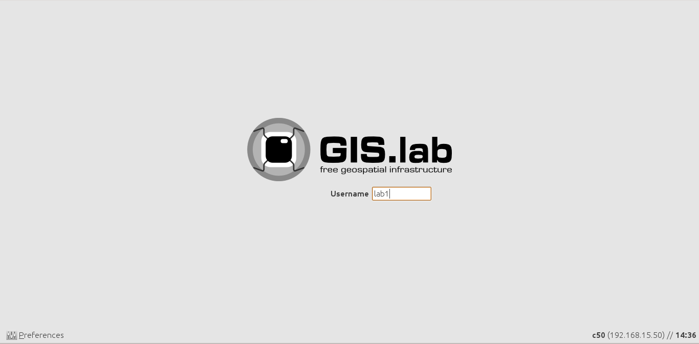

   client-login
Data preparation
----------------

-  create working directory called *my-first-project* in *~/Projects*
   directory
-  copy example SpatiaLite database file
   *~/Repository/gislab-project/natural-earth/natural-earth.sqlite* to
   *~/Projects/my-first-project* directory

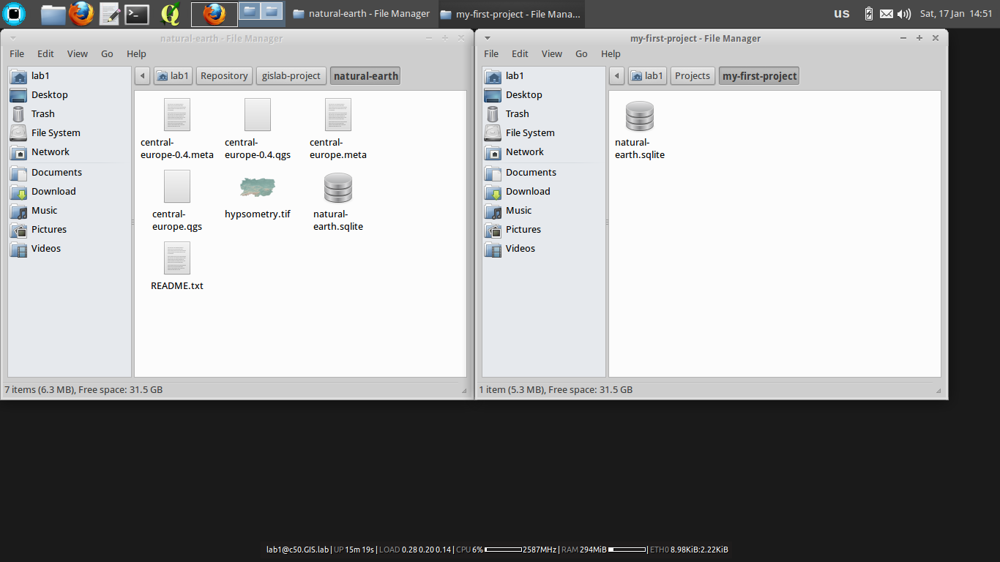

   first-project-copy-data
Project creation
----------------

-  launch *GIS.lab Desktop* (*GIS.lab > GIS.lab Desktop* applications
   menu). New project will be automatically created

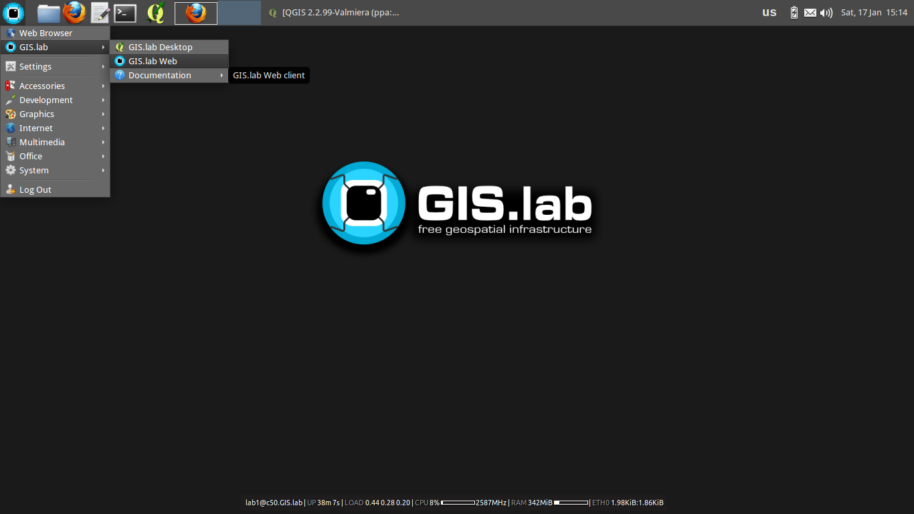

   gislab-desktop-applications-menu

-  add SpatiaLite database file to *GIS.lab Desktop* project (*Layer >
   Add SpatiaLite layer > New*)
-  connect to database by pressing *Connect* button

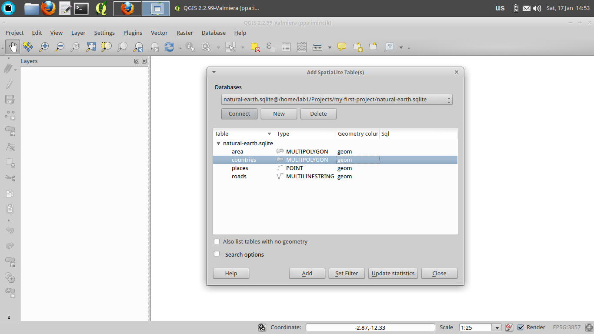

   first-project-connect-data

-  load *counties* layer by mouse selection and pressing *Add* button

.. figure:: images/quick-start/gis-project/first-project-countries-layer.png
   :alt: first-project-countries-layer

   first-project-countries-layer

-  set project title to *Countries of Central Europe* (*Project >
   Project Properties > Project title*)

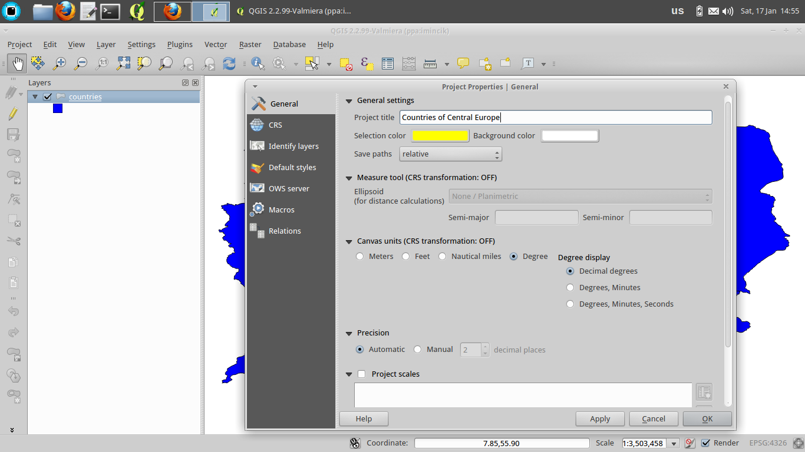

   first-project-title

-  save project as *~/Projects/my-first-project/europe.qgs* (*Project >
   Save*). Our first GIS project is ready

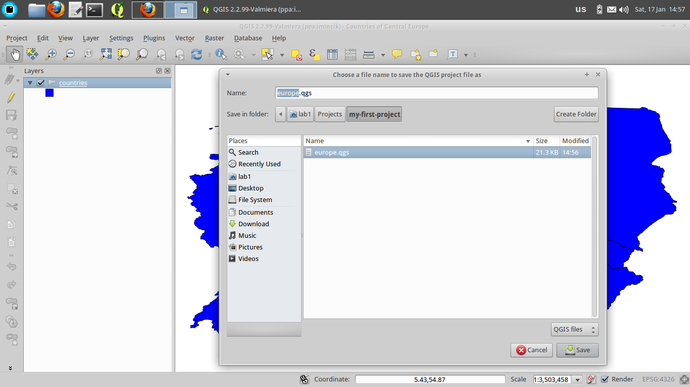

   first-project-save-europe
Project publishing
------------------

-  install *GIS.lab Web* plugin (*Plugins > Manage and Install Plugins*)

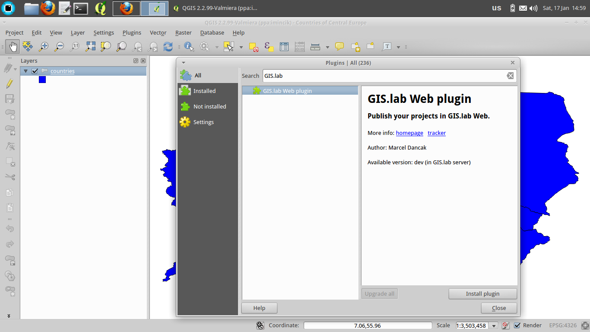

   gislab-web-plugin

-  launch *GIS.lab Web* plugin (*Web > GIS.lab Web > Publish in GIS.lab
   Web*). It is safe to ignore on-the-fly transformation warning

.. figure:: images/quick-start/gis-project/first-project-plugin-publish1.png
   :alt: first-project-plugin-publish1

   first-project-plugin-publish1

-  publish project by pressing *Next* button in wizard. Press *Publish*
   and *Finish* buttons on the last two pages

|first-project-plugin-publish2| |first-project-plugin-publish3|

-  copy whole directory *~/Projects/my-first-project* to
   *~/Publish/lab1* directory to finish project publishing

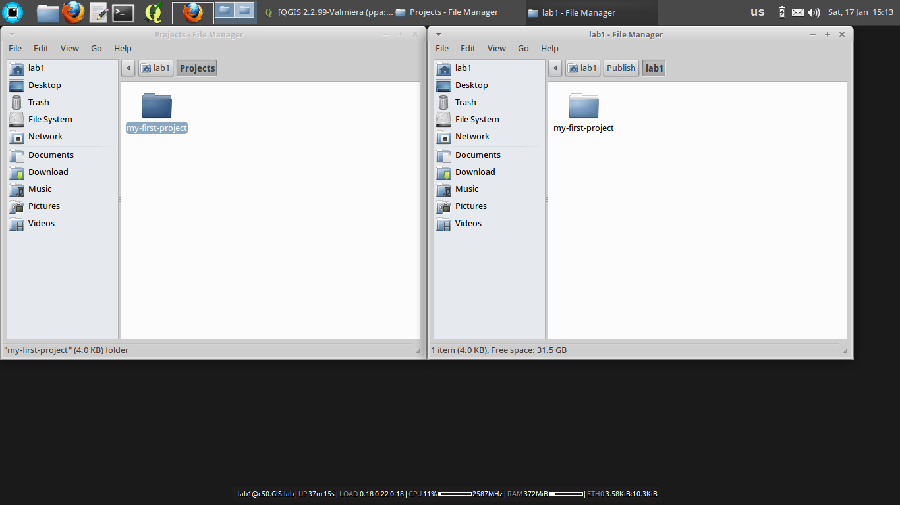

   first-project-copy-to-publish
Using project on web
--------------------

-  launch *GIS.lab Web* User page (*GIS.lab > GIS.lab Web* applications
   menu)

   gislab-web-applications-menu

-  ignore security warnings produced by self-signed certificate (*I
   Understand the Risks > Add Exception > Confirm Security Exception*)

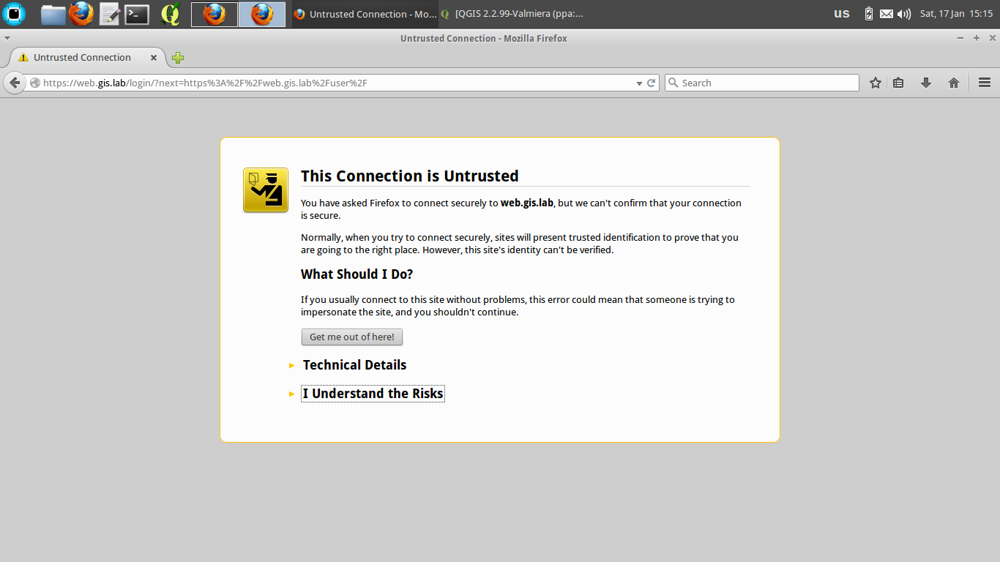

   gislab-web-user-page-warnings

-  log in to GIS.lab Web User page using 'lab1' user credentials

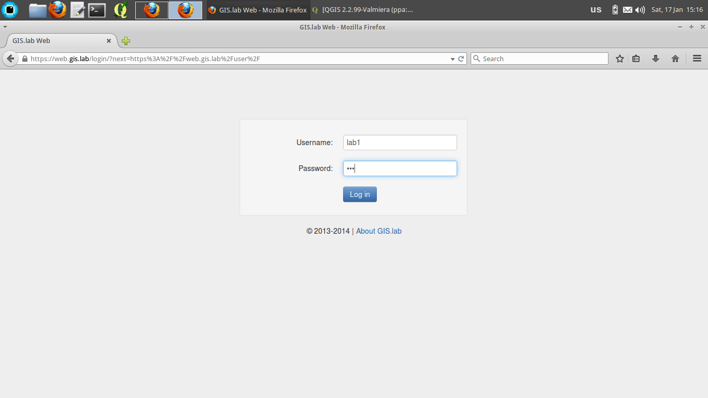

   gislab-web-user-page-login

-  inspect published project. Our project should be listed as second,
   right below default *Empty* project

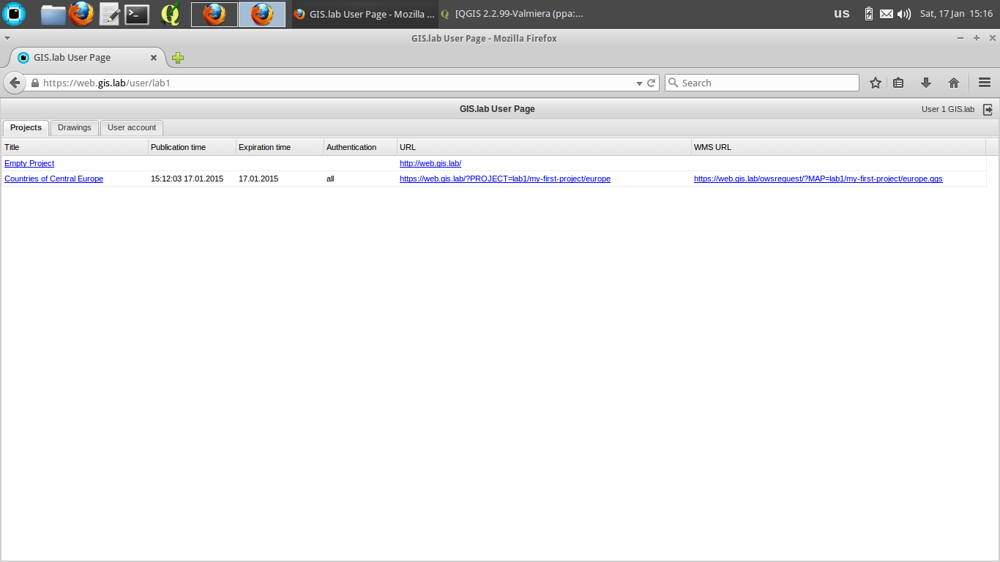

   gislab-web-user-page-projects

-  click on project's link in *URL* column to launch it

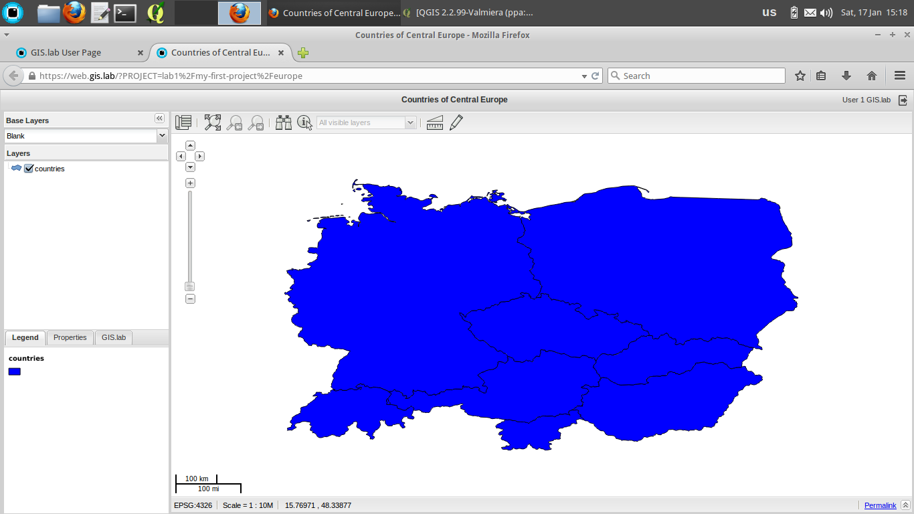

   gislab-web-first-project
What's next
-----------

To get more familiar with possible project configurations, copy whole
GIS.lab example project directory
*~/Repository/gislab-project/natural-earth* to *~/Projects* directory
and start exploring.

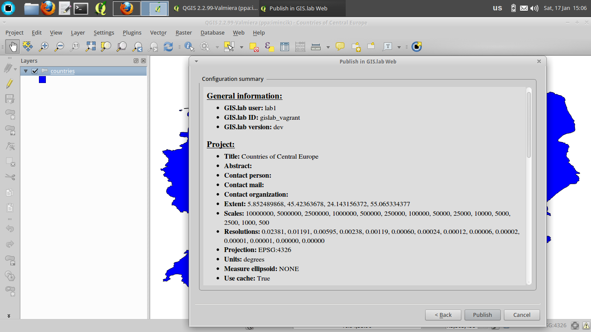
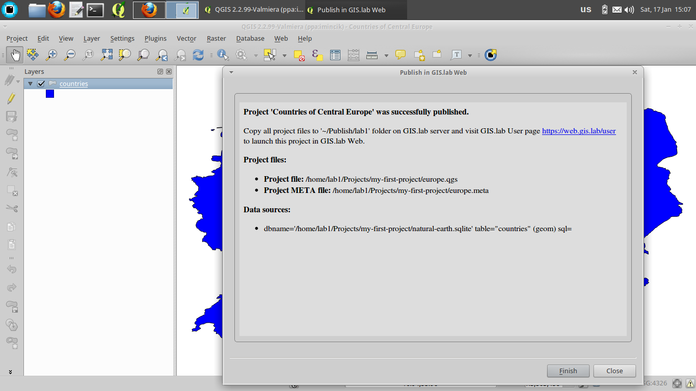
