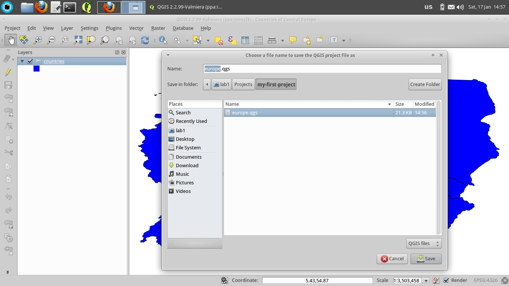
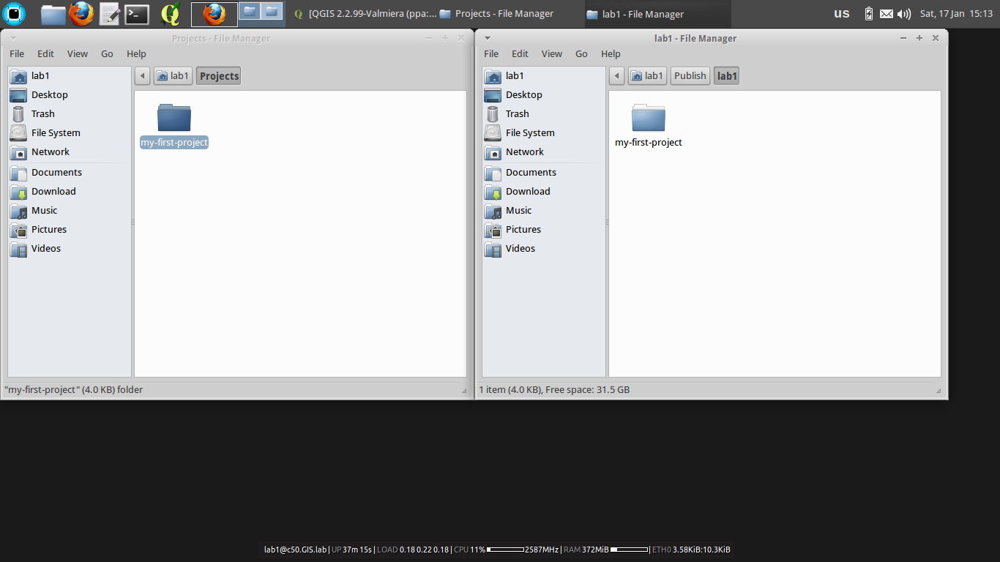
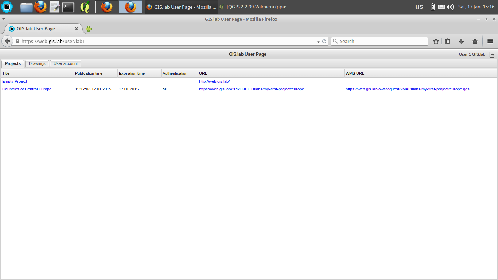
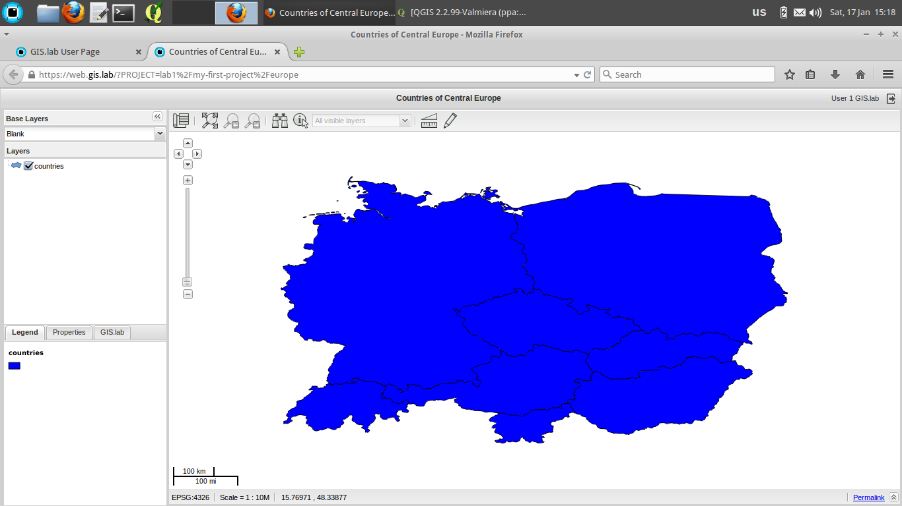

__GIS.lab__ projects are created and managed by __QGIS__ application, which is a main tool for all geospatial tasks. GIS.lab is containing its own version of QGIS, which is improved with bug fixes and features and it is accessible under _GIS.lab Desktop_ item in _GIS.lab_ applications menu.

__GIS.lab Web__ client is automatically publishing all GIS projects created in desktop to web environment.

Following steps will create simplest possible GIS project and will publish it on web.

## Log in
* log in to GIS.lab session using 'lab1' user credentials

  

## Data preparation
* create working directory called _my-first-project_ in _~/Projects_ directory
* copy example SpatiaLite database file _~/Repository/gislab-project/natural-earth/natural-earth.sqlite_ to _~/Projects/my-first-project_ directory

## Project creation
* launch _GIS.lab Desktop_ (_GIS.lab > GIS.lab Desktop_ applications menu). New project will be automatically created

* add SpatiaLite database file to _GIS.lab Desktop_ project (_Layer > Add SpatiaLite layer > New_)
* connect to database by pressing _Connect_ button

* load _counties_ layer by mouse selection and pressing _Add_ button

* set project title to _Countries of Central Europe_ (_Project > Project Properties > Project title_)

* save project as _~/Projects/my-first-project/europe.qgs_ (_Project > Save_). Our first GIS project is ready

## Project publishing
* install _GIS.lab Web_ plugin (_Plugins > Manage and Install Plugins_)

* launch _GIS.lab Web_ plugin (_Web > GIS.lab Web > Publish in GIS.lab Web_). It is safe to ignore on-the-fly transformation warning

* publish project by pressing _Next_ button in wizard. Press _Publish_ and _Finish_ buttons on the last two pages

* copy whole directory _~/Projects/my-first-project_ to _~/Publish/lab1_ directory to finish project publishing

## Using project on web
* launch _GIS.lab Web_ User page (_GIS.lab > GIS.lab Web_ applications menu)

* ignore security warnings produced by self-signed certificate (_I Understand the Risks > Add Exception > Confirm Security Exception_)

* log in to GIS.lab Web User page using 'lab1' user credentials

* inspect published project. Our project should be listed as second, right below default _Empty_ project

* click on project's link in _URL_ column to launch it

## What's next
To get more familiar with possible project configurations, copy whole GIS.lab example project directory _~/Repository/gislab-project/natural-earth_ to _~/Projects_ directory and start exploring.
