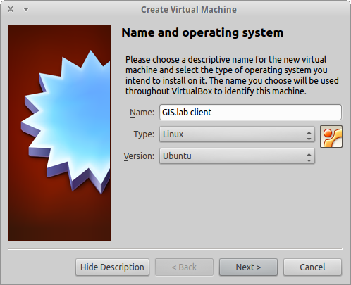
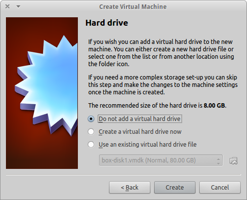
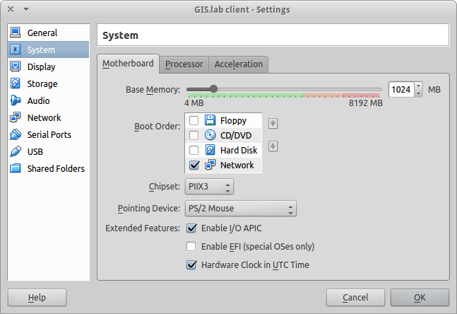
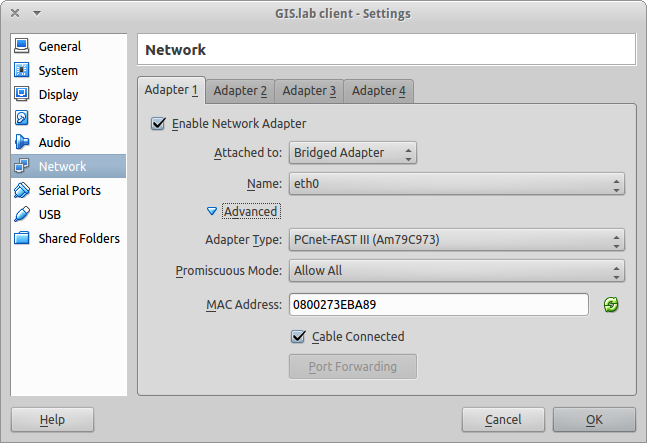
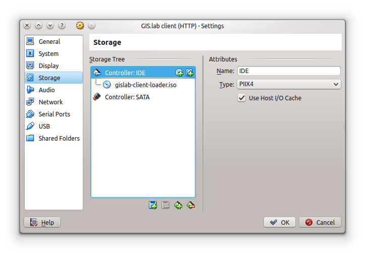
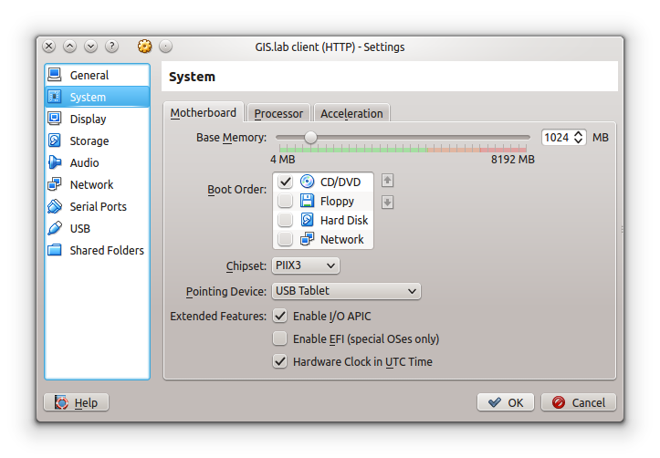
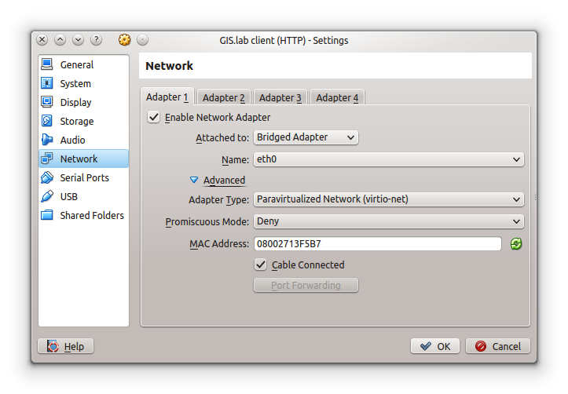
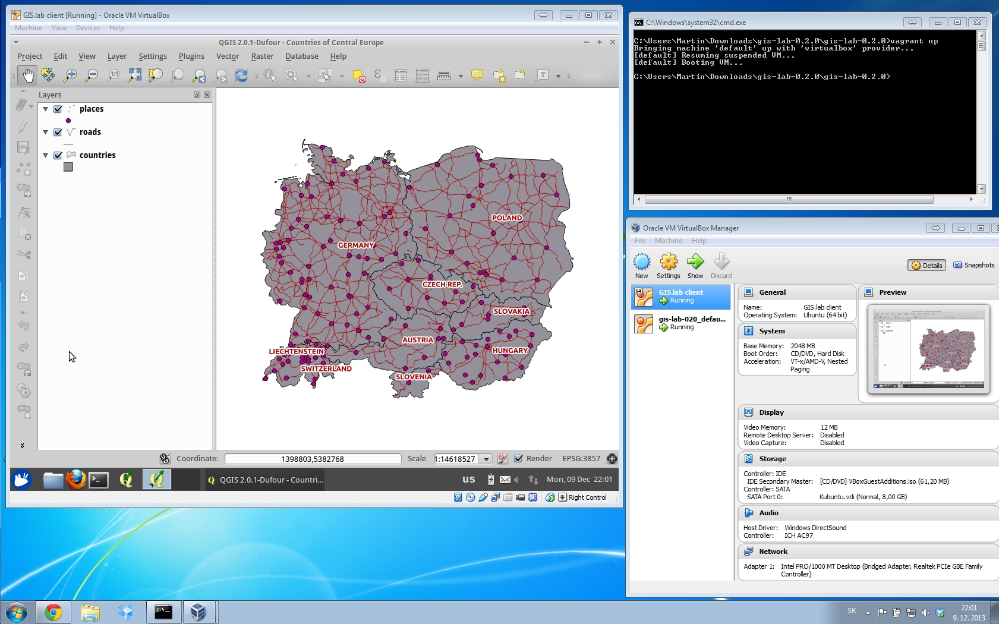

Running GIS.lab client in virtual mode is very useful when you want to keep working in your favourite operating system (for example your favourite Windows 7 OS) and still want to use GIS.lab environment. GIS.lab virtual client is running in VirtualBox virtual machine, which is capable to run on Windows, Linux or Mac OSX operating systems.

## Installation
Download and install VirtualBox for your system from https://www.virtualbox.org/wiki/Downloads .

## Virtual machine creation
Create new virtual machine in VirtualBox (Machine > New) with following configuration:  


Do not create any virtual hard drive  



## Booting
### PXE boot
PXE boot is a default boot mode for GIS.lab clients. It is a simplest method to get your client up and running, but it may not work if multiple DHCP boot servers or GIS.lab servers exists in network.

Configure boot order to boot only from network and enable IO APIC (Settings > System)  


Configure network adapter in bridged mode, make sure you select _PCnet-FAST III (Am79C973)_ as the adapter type and allow promiscuous mode for all (Settings > Network).  


### HTTP boot
In addition to default PXE boot method, GIS.lab clients can boot over HTTP, which can provide some advantages. See [HTTP boot page](Client-HTTP-boot) for more details.

HTTP boot is performed by loading system from special GIS.lab bootloader ISO image file, which exists in _http-boot/gislab-bootloader.iso_.

Add virtual _gislab-bootloader.iso_ file as virtual CD/DVD (Settings > Storage)


Configure boot order to boot only from virtual CD/DVD and enable IO APIC (Settings > System)  


Configure network adapter in bridged mode, make sure you select _Paravirtualized Network (virtio-net)_ as the adapter type and allow promiscuous mode for all (Settings > Network).  



## Enable client machine
Open _Advanced_ options and make a note of assigned _MAC Address_. It will be needed in next step.

Log in to GIS.lab server and allow your client machine to connect. 
```
$ vagrant ssh
$ sudo gislab-machines -a <MAC-address>
```

## Virtual client start
Start _GIS.lab client_ virtual machine, by pressing _Start_ button in _VirtualBox Manager_, log in and enjoy.


## Additional configuration
To set custom client display resolution run following command on host machine  
`$ VBoxManage controlvm "GIS.lab client" setvideomodehint <xresolution> <yresolution> 32`  
for example  
`$ VBoxManage controlvm "GIS.lab client" setvideomodehint 1000 660 32`


Continue with [Physical client](Physical-Client).


