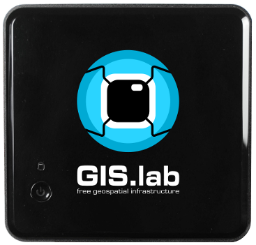

.. some substitutions:

.. |GL| replace:: GIS.lab

***********
Conventions
***********

In this documentation, you will find number of styles of text that distinguish 
between different kinds of information. Here are some types of headings, 
examples of typographical 
conventions, styles, and an explanation of their meaning.

********
Chapters
********

========
Sections
========

-----------
Subsections
-----------

^^^^^^^^^^^^^^
Subsubsections
^^^^^^^^^^^^^^

""""""""""
Paragraphs
""""""""""

#####
Parts
#####

**Bold** shows commands or other text indicates that we wish to draw your 
attention to a particular part of a code block, the relevant lines or items.

``Code text`` represents code, commands, options, switches, variables, 
attributes, keys, functions, types, classes, namespaces, methods, modules, 
properties, parameters, values, objects, events, event handlers, tags, macros, 
the contents of files, or the output from commands. More comprehensive
parts are written in blocks as follows: 

.. code::

	<code block>

*Italic* indicates new terms, URLs, email addresses, filenames, file extensions, 
pathnames, directories, and Unix utilities.

`Plain text` indicates menu titles, menu options, menu buttons, and keyboard 
accelerators.

.. tip:: |tip| This signifies a tip, suggestion, or general useful note.

.. attention:: |att| This style indicates a warning or caution.

.. note:: |note| This is note.

.. important:: |important| This represents something important.

Other roles like :superscript:`superscript` and :subscript:`subscript` text.

:title-reference:`This type of text is used for web pages, titles of books, periodicals, and other materials`.

Lists and Quote-like blocks are written as follows:

#. numbered list 
  #. nested numbered list

* bulleted list 

  * nested bulleted list

**Useful term**
   term of definition list ...

For usage of footnotes, see [#name]_, citations or references, see ref_, 
example of substitution is e.g. |GL| written as \|GL|, for usage of external 
hyperlinks, see e.g. `GIS.lab web page <http://web.gislab.io/>`_, for reference
to some picture, see :ref:`some-figure`.

.. _some-figure:

   GIS.lab unit, small.

.. _some-figure:

   GIS.lab unit, middle.

.. _some-figure:

   GIS.lab unit, large.

.. rubric:: Footnotes

.. [#name] The first footnote.

Referencies:

.. [ref] 

