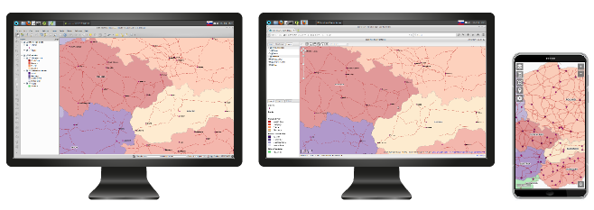
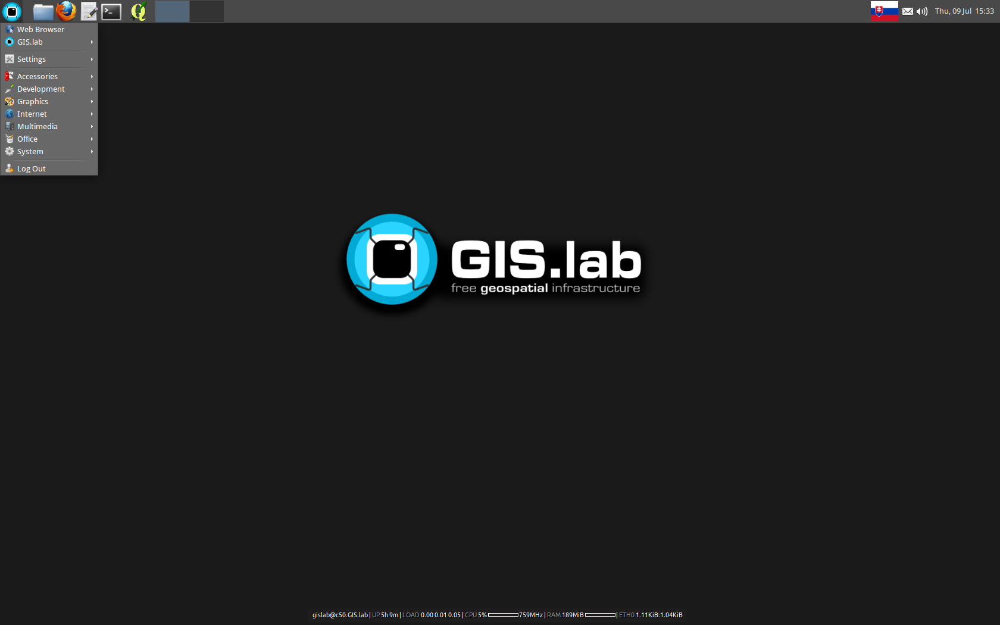

.. _start:

*****************
Let's get started
*****************

You may be coming to :ref:`GIS.lab <about>` from various operating system, 
but we expect that you are probably 
familiar with browsing the web, writing documents, sending emails and doing other 
jobrelated tasks with your computer. Whether you are somewhat experienced or 
completely new to computers, this documentation should be very useful for you.
Of course the more experience you have, the more quickly you will learn. 

In general, this documentation does not assume any computer experience on your 
part. We try to explain in detail what :ref:`GIS.lab Desktop<gislab>`, 
:ref:`GIS.lab Web <gislab-web>` and :ref:`GIS.lab Mobile <gislab-mobile>` 
are. We even tell you how to install 
and how to use every of these pieces in the most efficient way. 

.. _desktop-web-mobile:

   GIS.lab Desktop, GIS.lab Web and GIS.lab Mobile interface.

Firstly, there are sections related to introduction like 
:ref:`Learning about the pieces <about>`, :ref:`Useful terms <terms>` 
or :ref:`Useful commands <commands>`.
To distinguish between different kinds of information we use some typographical
and stylistic features, see chapter
:ref:`Conventions used in this documentation <conventions>`. 
In case you feel sufficiently familiar with all the introductory parts just skip 
them and go straight away to :ref:`GIS.lab Installation <gislab-installation>`
of GIS.lab Desktop form. Section 
:ref:`Client Desktop layout <client-desktop-layout>` relates to GIS.lab client
environment with GIS and no GIS applications.
To get to know about QGIS projects publishing on web, see 
:ref:`GIS.lab Web <gislab-web>` part.
Chapters dedicated to providing practical skills with GIS.lab technology
are :ref:`GIS.lab un practice <practice>` and :ref:`GIS.lab workshop <workshop>`.

.. _gislab-desktop-start:

   GIS.lab Desktop screen.

Moreover, when you meet some trouble or difficulty, you can find solutions to 
simple and difficult problems in :ref:`Problem solving <problems>` part.
