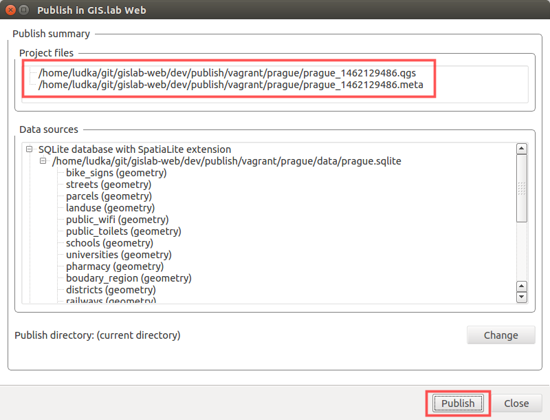
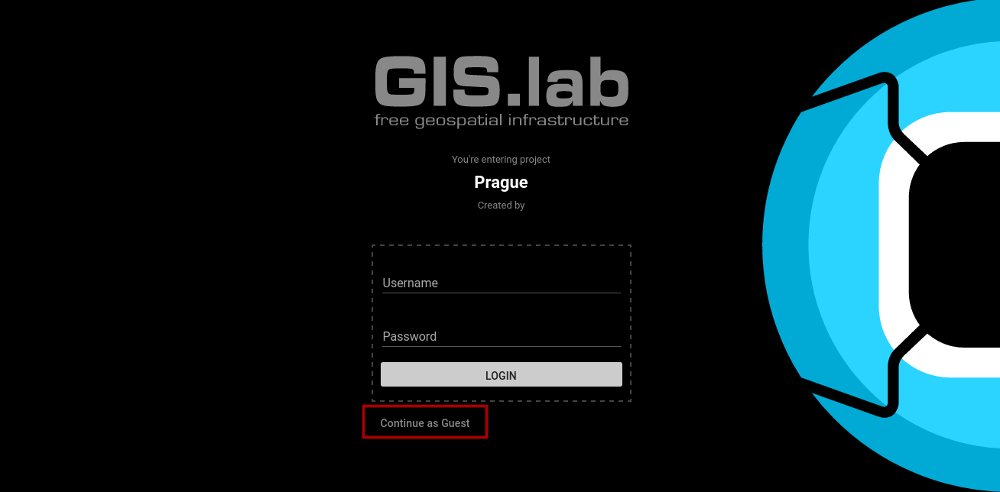

.. _project-publishing:
 
==================
Project publishing
==================

When ``Publish`` button is pressed in GIS.lab QGIS 
:ref:`plugin dialog <gislab-qgis-plugin-publish>`, 
unique project file name with timestamp together with it's metafile are created.

   Part of GIS.lab project publishing process.

Then it is necessary to **copy** published QGIS project with all associated data 
to ``vagrant`` directory that is located in ``gislab-web`` source code.

   Directory for QGIS projects going to be published.

Finally, open web browser and launch published project in GIS.lab Web interface
by entering URL below.

.. code:: 

   https://localhost:8000?PROJECT=vagrant/<project-directory-name>/<qgs-file-name>

There will be welcome screen with possibility to enter credential, but you can
``Continue as guest``, see :num:`#gislab-web-welcome`. 

.. _gislab-web-welcome:

   GIS.lab Web welcome screen.

Then there are no obstacles to enjoy your published project.

   QGIS project published with GIS.lab Web.

