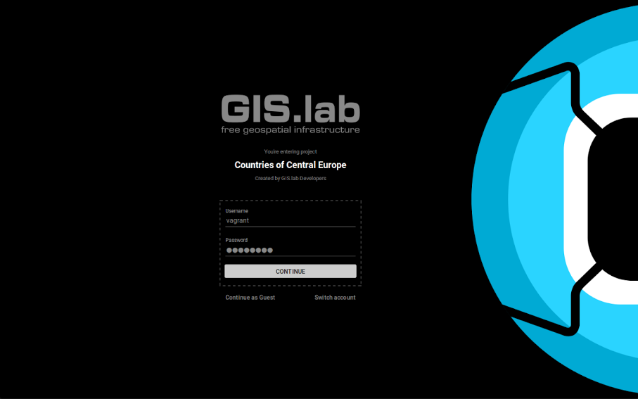

.. |note| image:: img/note.png
   :width: 1.5em

.. _gislab-main:

.. GIS.lab documentation master file, created by
   sphinx-quickstart on Fri Mar 11 12:08:21 2016.
   You can adapt this file completely to your liking, but it should at least
   contain the root `toctree` directive.

.. raw:: html

   <h1>
Welcome to GIS.lab documentation!
</h1>
   

   
<em>Your voyage to land of GIS.lab starts here. 
   Go beyond the basics and unleash the full power of GIS.lab with useful,
   step-by-step examples how to install it, use it and take your first 
   step.</em>

   

========
Contents
========

.. toctree::
   :maxdepth: 1

   start
   about
   terms
   commands
   conventions

.. toctree::
   :maxdepth: 2
   :numbered:

   installation/index
   customization/index
   practice/index
   gislab-web/index
   gislab-mobile/index
   wiki/index*

.. toctree::
   :maxdepth: 1

   datasets
   problems
   communication
   credits

.. note:: |note.| GIS.lab is still in pre-release state
