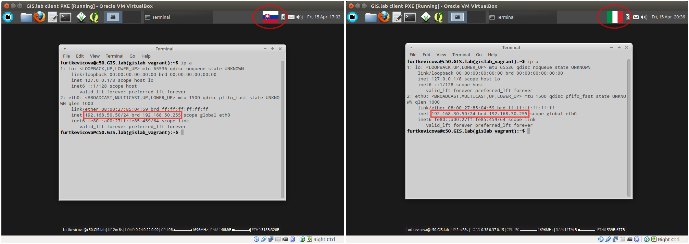

.. _configuration:
 
*************
Configuration
*************

It is recommended to set at least some basic configuration before
GIS.lab installation is performed. 

GIS.lab is designed to install and run out of box with default
configuration. However, it is required to change at least default network
configuration variable ``GISLAB_NETWORK``, if GIS.lab's default network
range ``192.168.50.0/24`` already exists in LAN to prevent IP conflicts.

Default GIS.lab configuration file named ``all`` exists in ``system/group_vars``,
see :num:`#configuration-files`.
When user decides to adjust it, this file should not be modified directly. 

.. tip:: |tip| Find that file in GIS.lab repository and see its content to 
   become acquainted with all possibilities of configuration settings. 
   It is full of commented out information. 

.. rubric:: Virtual mode

For installation in VirtualBox it is recommended to create file
named ``gislab_vagrant`` in ``system/host_vars`` directory for host specific 
GIS.lab configuration and put various changes there. 

.. rubric:: Physical mode

When Physical mode is used, file in ``system/group_vars`` should
be named according to name of GIS.lab unit. This name is a part 
of Ansible inventory file content, script that Ansible uses
to determine what to provide. All file names must always match unique 
host name specified in inventory file.

.. _configuration-files:

   Directory structure of configuration files.

File ``gislab_vagrant`` will be loaded automatically by Vagrant 
without need to manually create the Ansible inventory file. Example 
configuration in ``gislab_vagrant`` or ``<name-of-gislab-unit>``
file is shown below.

.. code:: sh

   GISLAB_ADMIN_FIRST_NAME: Ludmila
   GISLAB_ADMIN_SURNAME: Furtkevicova
   GISLAB_ADMIN_EMAIL: ludmilafurtkevicov@gmail.com

   GISLAB_NETWORK: 192.168.50
   GISLAB_TIMEZONE: Europe/Rome
   GISLAB_DNS_SERVERS:
    - 10.234.10.10
    - 8.8.8.8
   
   GISLAB_CLIENT_ARCHITECTURE: amd64
   GISLAB_CLIENT_LANGUAGES:
    - en
    - sk
    - it
   
   GISLAB_CLIENT_KEYBOARDS:
     - layout: en
       variant: qwerty
     - layout: sk
       variant: qwerty
     - layout: it
       variant: qwerty
   
   GISLAB_CLIENT_OWS_WORKER_MIN_MEMORY: 4000

Let's see practical example of configuration with 
some changes related to GIS.lab network and client keyboards in virtual mode.
Variables ``GISLAB_NETWORK`` and ``GISLAB_CLIENT_KEYBOARDS`` in ``gislab_vagrant``
file will be different. Results after the successful installation for both cases 
are in :num:`#config-virtual`.

.. tip:: |tip| See :ref:`Installation in Virtual Mode <installation-virtual>`
   section for more details about the steps or just use ``vagrant provision``
   command which is used to install and configure the machine Vagrant is managing .

.. code:: sh

   file gislab_vagrant 'A'                        file gislab_vagrant 'B'
   -----------------------                        ----------------------- 
   GISLAB_NETWORK: 192.168.50                     GISLAB_NETWORK: 192.168.30
                                 
   GISLAB_CLIENT_KEYBOARDS:                       GISLAB_CLIENT_KEYBOARDS:
   - layout: sk                                   - layout: it
     variant: qwerty                                variant: qwerty

.. _config-virtual:

   Two different results using different Vagrant configuration file.

Fourth number of server's IP address will always be ``5`` and the first client's 
IP address will always terminate with ``50``. For left case of :num:`#config-virtual` 
these addresses would look like ``192.168.50.5`` and ``192.168.50.50``.

.. note:: |note| This information is useful in Manual GIS.lab server selection  
          using :ref:`HTTP boot <http-boot>` when server's IP address is required.

Content of Ansible inventory file called ``<name-of-gislab-unit>.inventory`` 
used in physical mode would be as follows.
 
.. code:: sh
      
   <name-of-gislab-unit> ansible_ssh_host=<host-url> ansible_ssh_user=<provisioning-user-account-name>

.. note:: |note| Example content of ``gislab-unit-fem.inventory`` file is shown 
   below.

   .. code:: sh
      
      gislab-unit-fem ansible_ssh_host=10.234.1.44 ansible_ssh_user=ubuntu

.. todo:: |todo| `??? Network configurations ??? <https://github.com/gislab-npo/gislab/wiki/Network-configurations>`_
