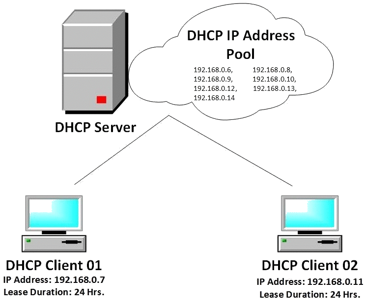
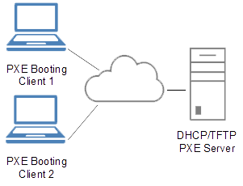

.. _terms:

************
Useful terms
************

*AMD64*
   platform, the 64-bit version of the x86 instruction set, x86 means 32-bit OS

*Ansible*
   an easy to use configuration management and orchestration tool, it is platform 
   that can combine multi-node software deployment and ad hoc task execution, 
   Ansible’s configuration, deployment, and orchestration language are playbooks
   expressed in YAML format; Ansible is an automation engine, similar to 
   `Chef <https://www.chef.io/>`_ or `Puppet <https://puppetlabs.com/>`_, 
   that can be used to ensure deployment and configuration consistency 
   across many servers, and keep servers and applications up-to-date

*Bridged networking*
   connects a virtual machine to a network by using the network adapter on the 
   host system, the virtual machine is a full participant in the network

.. figure:: img/bridged_networking.png
   :align: center
   :width: 250

   Bridged Networking Configuration [#bnc]_

*Client machine*
   machine which runs GIS.lab client system launched from GIS.lab server

*Configuration*
   an arrangement of functional units, often pertains to the choice of hardware, 
   software, firmware, and documentation, it affects system function and performance

*Customization*
   doing some modification over an existing applications according to requirements 
   of the client

*Dev*
   development tools, software developer or device in PC

*DHCP server*
    *Dynamic Host Configuration Protocol*, way how to set host's IP address to 
    automatically assign an IP address to any host on the network upon the request
    (in order for two hosts communicate on the same network using TCP/IP model, 
    both hosts need to have an unique IP address); GIS.lab has own DHCP server

   DHCP server [#dhcp]_

*GIS.lab node*
   GIS.lab client environment which runs on client machine

*GIS.lab master* 
   GIS.lab server environment which runs as virtualized system on host machine

*Host machine*
   main machine where Vagrant, VirtualBox and GIS.lab package are installed

*Chroot*

*GUI*
   *Graphical User Interface*

*I386, x86*
   ordinary platform, 32-bit microprocessor

*IA64*
   platform, 64-bit microprocessor

*IP address*
   *Internet Protocol address*, numerical identifier assigned to each device 
   participating in a computer network that uses the Internet Protocol for 
   communication, it is 32-bit numeric address written as four numbers ``0.0.0.0`` 
   separated by periods, each number can be zero to 255, it is assigned as part 
   of connecting to a network

*ISO*
   an archive file of an optical disc, image file is a snapshot of the data and 
   layout of a CD or DVD, saved in ISO-9660 format, widely used for storing CD 
   content

*MAC address*
   *Media Access Control address*, kind of serial number assigned to every 
   network adapter, no two anywhere 
   should have the same MAC address, it is assigned at the time hardware is 
   manufactured, the computer needs to have its MAC address registered in 
   the DNS/DHCP so that it'll be recognized and get the right IP address,
   six groups of two hexadecimal digits separated by colons ``0:0:0:0:0:0`` or
   by hyphens ``0-0-0-0-0-0`` or three groups of four hexadecimal digits 
   separated by dots ``0.0.0``

*PXE booting*
   *Preboot Execution Environment* booting, is a method of having an end computer 
   (client) boot using only its network card, 
   it is industry standard client/server 
   interface that allows networked computers that are not yet loaded with an 
   operating system to be configured and booted remotely by an administrator,
   PXE provides e.g. DHCP, application program interfaces that are 
   used by the client's Basic Input/Output Operating System (BIOS), etc. 

   PXE overview [#pxe]_

*Travis CI*
   a FOSS, hosted, distributed continuous integration service used to build 
   and test software projects hosted at GitHub, it is configured by adding a 
   YAML format text file to the root directory of the repository

*Vagrant*
   a cross-platform tool for working with Virtual Machines, it does networking 
   out-of-the-box and solves problems in a modular way, it represents the command 
   line utility for managing the lifecycle of virtual machines,
   to describe the type of machine required for a project, and how to configure 
   and provision these machines *Vagrantfile* with Ruby syntax is used,
   process means **set up** (downloading and installing Vagrant), **configure** 
   (creating a single file with description) and **work** (running ``vagrant up``)

*Vagrant box*
   the package format for Vagrant environment, it is used to bring up an 
   identical working environment, 
   

.. seealso:: |see.| 
   
   * `19 Minutes With Ansible <https://sysadmincasts.com/episodes/43-19-minutes-with-ansible-part-1-4>`_
   * `Booting from the network with PXE <https://www.youtube.com/watch?v=zQ-TQhmjhuc>`_
   * `Vagrant in 5 minutes <https://opensource.com/business/16/1/lightning-talk-quick-introduction-vagrant?sc_cid=701600000011jJaAAI>`_
   

.. rubric:: Source

.. [#bnc] `Configuring Bridged Networking <http://pubs.vmware.com/ws8/wwhelp/wwhimpl/js/html/wwhelp.htm#href=using_ws/GUID-BAFA66C3-81F0-4FCA-84C4-D9F7D258A60A.html#1_14_9_1>`_
.. [#dhcp] `DHCP server <http://www.tomshardware.co.uk/faq/id-1932036/dhcp-server-assigns-addresses-client-computers.html>`
.. [#pxe] `Preboot Execution Environment <https://en.wikipedia.org/wiki/Preboot_Execution_Environment>`_
