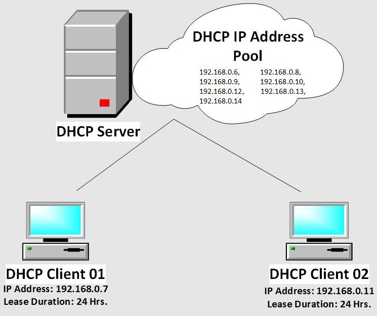

.. _terms:

************
Useful terms
************

*Ansible*
   an easy to use configuration management and orchestration tool, it is platform 
   that can combine multi-node software deployment and ad hoc task execution, 
   Ansible’s configuration, deployment, and orchestration language are playbooks
   expressed in YAML format 

*Bridged networking*
   connects a virtual machine to a network by using the network adapter on the 
   host system, the virtual machine is a full participant in the network

.. figure:: img/bridged_networking.png
   :align: center
   :width: 450

   Bridged Networking Configuration [#bnc]_

*Client machine*
   machine which runs GIS.lab client system launched from GIS.lab server

*Configuration*
   an arrangement of functional units, often pertains to the choice of hardware, 
   software, firmware, and documentation, it affects system function and performance

*Customization*
   doing some modification over an existing applications according to requirements 
   of the client

*DHCP server*
    *Dynamic Host Configuration Protocol*, way how to set host's IP address to 
    automatically assign an IP address to any host on the network upon the request
    (in order for two hosts communicate on the same network using TCP/IP model, 
    both hosts need to have an unique IP address); GIS.lab has own DHCP server

   DHCP server [#dhcp]_

*GIS.lab client*
   GIS.lab client environment which runs on client machine

*GIS.lab server*
   GIS.lab server environment which runs as virtualized system on host machine

*Host machine*
   main machine where Vagrant, VirtualBox and GIS.lab package are installed

*Chroot*

*IP address*
   *Internet Protocol address*, numerical identifier assigned to each device 
   participating in a computer network that uses the Internet Protocol for 
   communication, it is 32-bit numeric address written as four numbers `x.x.x.x` 
   separated by periods, each number can be zero to 255, it is assigned as part 
   of connecting to a network

*MAC address*
   *Media Access Control address*, kind of serial number assigned to every 
   network adapter, no two anywhere 
   should have the same MAC address, it is assigned at the time hardware is 
   manufactured, the computer needs to have its MAC address registered in 
   the DNS/DHCP so that it'll be recognized and get the right IP address 

.. seealso:: |see| 
   
   `19 Minutes With Ansible <https://sysadmincasts.com/episodes/43-19-minutes-with-ansible-part-1-4>`_

.. rubric:: Source

.. [#bnc] `Configuring Bridged Networking <http://pubs.vmware.com/ws8/wwhelp/wwhimpl/js/html/wwhelp.htm#href=using_ws/GUID-BAFA66C3-81F0-4FCA-84C4-D9F7D258A60A.html#1_14_9_1>`_
.. [#dhcp] `DHCP server <http://www.tomshardware.co.uk/faq/id-1932036/dhcp-server-assigns-addresses-client-computers.html>`
